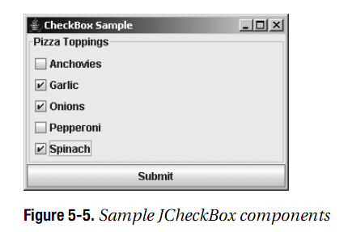
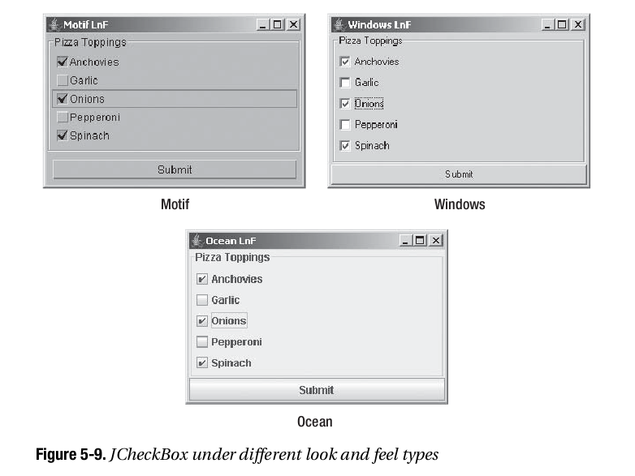
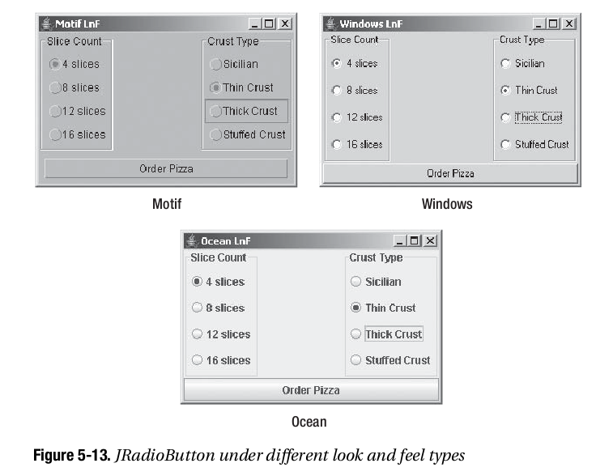

Toggle Buttons
==============

现在我们已经了解了相对简单的Swing组件JLabel与JButton的功能，现在我们来了解一些更为活跃的组件，特别是这些可以切换的组件。这些称之为可切换的组件－JToggleButton，JCheckBox与JRadioButton－为我们的用户提供了由一个选项集合中进行选择的方法。这些选项或者是打开，或者是关闭的，或者是允许，或者是禁止的。当表示在一个ButtonGroup中时，每次组中只有一个选项可以被选中。为了处理选中状态，组件与ToogleButtonModel共享一个共同的数据模型。下面我们来了解一下数据模型，使用ButtonGroup的组件组合机制，以及单个的组件。

ToggleButtonModel类
-------------------

JToggleButton.ToggleButtonMode类是JToggleButton的一个公开内联类。这个类自定义了DefaultButtonModel类的行为，实现了ButtonModel接口。

自定义行为影响了ButtonGroup组件中所有AbstractButto的数据模型，ButtonGroup会在稍后的进行探讨。简单来说，一个ButtonGroup是AbstractButton组件的逻辑组合。在任意时刻，ButtonGroup中只有一个AbstractButton组件的selected属性被设置true，其他的必须为false。这并不意味着在组合中任意时刻只存在一个被选中的组件。如果ButtonGroup中的多个组件共享一个ButtonModel，那么在组合中就可以存在多个被选中的组件。如果没有组件共享模型，那么在组合中用户至多可以选中一个组件。一旦用户已经选择了一个组件，用户并不能交互的取消选择。然而，通过编程我们可以取消选中所有的组合元素。

JToggleButton.ToggleButtonModel定义如下：

``` java
public class ToggleButtonModel extends DefaultButtonModel {
  // Constructors
  public ToggleButtonModel();
  // Properties
  public boolean isSelected();
  public void setPressed(boolean newValue);
  public void setSelected(boolean newvalue);
}
```

ToggleButtonModel类为JToogleButton以及其后面章节中所描述的子类JCheckBox与JRadioButton，以及将在第6章进行描述的JCheckBoxMenuItem与JRadioButtonMenuItem类定义了默认的数据模型。

ButtonGroup类
-------------

在描述ButtonGroup类之前，我们先来演示其用法。列表5-1中的程序创建了使用ToggleButtonModel的对象并将其放在一个组合中。正如程序所演示的，除了向屏幕容器添加组件之外，我们必须将每一个组件添加到相同的ButtonGroup中。这导致了对于每一个组件的一对add()方法调用。而且，按钮组合的容器会将组件放在一列中，并且使用一个带有标题的边框为用户标识组合，尽管这些并不是必须的。图5-1显示了程序的输出。

``` java
package swingstudy.ch04;

import java.awt.BorderLayout;
import java.awt.EventQueue;
import java.awt.GridLayout;

import javax.swing.AbstractButton;
import javax.swing.BorderFactory;
import javax.swing.ButtonGroup;
import javax.swing.JCheckBox;
import javax.swing.JCheckBoxMenuItem;
import javax.swing.JFrame;
import javax.swing.JPanel;
import javax.swing.JRadioButton;
import javax.swing.JRadioButtonMenuItem;
import javax.swing.JToggleButton;
import javax.swing.border.Border;

public class AButtonGroup {

    /**
     * @param args
     */
    public static void main(String[] args) {
        // TODO Auto-generated method stub

        Runnable runner = new Runnable() {
            public void run() {
                JFrame frame = new JFrame("Button Group");
                frame.setDefaultCloseOperation(JFrame.EXIT_ON_CLOSE);

                JPanel panel = new JPanel(new GridLayout(0,1));
                Border border = BorderFactory.createTitledBorder("Examples");
                panel.setBorder(border);

                ButtonGroup group = new ButtonGroup();
                AbstractButton abstract1 = new JToggleButton("Toggle Button");
                panel.add(abstract1);
                group.add(abstract1);

                AbstractButton abstract2 = new JRadioButton("Radio Button");
                panel.add(abstract2);
                group.add(abstract2);

                AbstractButton abstract3 = new JCheckBox("Check Box");
                panel.add(abstract3);
                group.add(abstract3);

                AbstractButton abstract4 = new JRadioButtonMenuItem("Radio Button Menu Item");
                panel.add(abstract4);
                group.add(abstract4);

                AbstractButton abstract5 = new JCheckBoxMenuItem("Check Box Menu Item");
                panel.add(abstract5);
                group.add(abstract5);

                frame.add(panel, BorderLayout.CENTER);
                frame.setSize(300, 200);
                frame.setVisible(true);

            }
        };
        EventQueue.invokeLater(runner);
    }

}
```


正如前面所说的，ButtonGroup类表示AbstractButton组件的逻辑组合。ButtonGroup并不是一个可视化组件；所以，当使用ButtonGroup时在屏幕上并没有任何可见的内容。任何的AbstractButton组件可以通过public
void add(AbstractButton
abstractButton)方法添加到组合中。尽管任意的AbstractButton组件都可以属于一个ButtonGroup，只有当组件的数据模型是ToggleButtonModel时组合才会起作用。在ButtonGroup中具有一个模型为ToggleButtonModel的组件的结果是在组件被选中之后，ButtonGroup会出取消选中组合中当前被选中的组件。

尽管add()方法通常是我们唯一需要的方法，下面的类定义显示了其并不是ButtonGroup中唯一的方法：

``` java
public class ButtonGroup implements Serializable {
  // Constructor
  public ButtonGroup();
  // Properties
  public int getButtonCount();
  public Enumeration getElements();
  public ButtonModel getSelection();
  // Other methods
  public void add(AbstractButton aButton);
  public boolean isSelected(ButtonModel theModel) ;
  public void remove(AbstractButton aButton);
  public void setSelected(ButtonModel theModel, boolean newValue);
}
```

如上的类定义所显示的一件有趣的事就是给定一个ButtonGroup，我们并不能直接确定被选中的AbstractButton。我们只可以直接查询哪一个ButtonModel被选中。然而，getElements()可以返回组合中所有AbstractButton元素的Enumeration。然后我们可以使用类似如下的代码在所有的按钮中进行遍历来确定被选中的按钮：

``` java
Enumeration elements = group.getElements();
while (elements.hasMoreElements()) {
  AbstractButton button = (AbstractButton)elements.nextElement();
  if (button.isSelected()) {
    System.out.println("The winner is: " + button.getText());
    break; // Don't break if sharing models -- could show multiple buttons selected
  }
}
```

ButtonGroup另一个有趣的方法就是setSelected()。这个方法的两个参数是ButtonModel与boolean。如果boolean的值为false，则选中的请求会被忽略。如果ButtonModel并不是ButtonGroup中的按钮的模型，那么ButtonGroup会取消选中当前被选中的模型，从而使得组合中没有按钮被选中。这个方法的正确使用是使用组合中组件的模型以及一个true的新状态进行方法调用。例如，如果aButton是一个AbstractButton而aGroup是ButtonGroup，那么方法的调用类似于aGroup.setSelected(aButton.getModel(),
true)。

下面我们来了解一下数据模型为ToggleButtonModel的各种组件。

JToggleButton类
---------------

JToggleButton是第一个可切换的组件。首先讨论JToggleButton类是因为他是其他们非面向菜单的组件，JCheckBox与JRadioButton，的父类。JToggleButton类似于JButton，当被选中时处理按下状态，相反则会返回到未选中状态。要取消被选中的组件，我们必须重新选择该组件。JToggleButton并不是一个被广泛使用的组件，但是我们会发现在工具栏上这个组件会非常有用，例如在Microsoft
Word中或是在一个文件对话奇巧事，如图5-2所示。


定义JToggleButton结构是两个自定义AbstractButton父类的对象：ToggleButonModel与ToggleButtonUI。ToggleButtonModel类表示组件的自定义的ButtonModel数据模型，而ToggleButtonUI则是用户接口委托。

下面我们已经了解了JToggleButton的不同方面，现在我们来了解一下如何使用。

### 创建JToggleButton组件

对于JToggleButton有八个构造函数：

``` java
public JToggleButton()
JToggleButton aToggleButton = new JToggleButton();

public JToggleButton(Icon icon)
JToggleButton aToggleButton = new JToggleButton(new DiamondIcon(Color.PINK))

public JToggleButton(Icon icon, boolean selected)
JToggleButton aToggleButton = new JToggleButton(new DiamondIcon(Color.PINK), true);

public JToggleButton(String text)
JToggleButton aToggleButton = new JToggleButton("Sicilian");

public JToggleButton(String text, boolean selected)
JToggleButton aToggleButton = new JToggleButton("Thin Crust", true);

public JToggleButton(String text, Icon icon)
JToggleButton aToggleButton = new JToggleButton("Thick Crust",
  new DiamondIcon(Color.PINK));

public JToggleButton(String text, Icon icon, boolean selected)
JToggleButton aToggleButton = new JToggleButton("Stuffed Crust",
  new DiamondIcon(Color.PINK), true);

public JToggleButton(Action action)
Action action = ...;
JToggleButton aToggleButton = new JToggleButton(action);
```

每一个都允许我们自定义一个或是多个标签，图标，或是初始选中状态。除非指定，标签是空的，没有文本或是图标，而按钮初始时未被选中。

### JToggleButton属性

在创建了JToggleButton之后，我们就可以修改其属性。尽管JToggleButton有近100个继承的属性，表5-1只显示了JToggleButton所引入的两个属性。其余的属性来自于AbstractButton，JComponent，Container以及Component。

  ---------------------- ---------------------- -----------
  属性名                 数据类型               访问性
  accessibleContext      AccessibleContext      只读
  UIClassID              String                 只读
  ---------------------- ---------------------- -----------

Table: JToggleButton属性

我们可以在构造函数中修改一个或是多个text,
icon或是selected属性，以及第4章所描述的其他的AbstractButton属性。我们可以通过getter与setter方法配置基本的三个属性：get/setText(),
get/setIcon()以及is/setSelected()或setAction(action)。其他的属性也具有相应的getter与setter方法。

JToggleButton的更多的可视化配置选项包括按钮不同状态的各种图标。除了标准图标以外，当按钮被选中时，我们可以显示一个不同的图标。然而，如果我们正基于当前的选中状态修改图标，那么JToggleButton也许并不是最合适的组件。我们可以修改其子类，JCheckBox或是JRadioButton，我们会在本章稍后进行讨论。

### 处理JToggleButton选中事件

在配置了JToggleButton之后，我们可以使用三种方法来处理选中事件：使用ActionListener，ItemListener或是ChangeListener。除了向构造函数提供Action之外，被通知的方式类似于ActionListener。

**使用ActionListener监听JToggleButton事件**

如果我们只对当用户选中或是取消选中JToggleButton时所发生事件感兴趣，我们将ActionListener与组件相关联。在用户选中按钮之后，组件会通知任何已注册的ActionListener对象。不幸的是，这并不是所需要的行为，因为我们必须主动确定按钮的状态，从而我们能够对选中或是取消选中进行正确的响应。要确定选中状态，我们必须获取事件源的模型，然后查询其选中状态，如下面的ActionListener示例源码所示：

``` java
ActionListener actionListener = new ActionListener() {
  public void actionPerformed(ActionEvent actionEvent) {
    AbstractButton abstractButton = (AbstractButton)actionEvent.getSource();
    boolean selected = abstractButton.getModel().isSelected();
    System.out.println("Action - selected=" + selected + "\ n");
  }
};
```

**使用ItemListener监听JToggleButton事件**

关联到JToggleButton更好的监听器是ItemListener。ItemEvent会被传递到ItemListener的itemStateChanged()方法，包括按钮当前的选中状态。这使得我们可以进行正确的响应，而不需要查询当前的按钮状态。

为了演示，下面的ItemListener报告被选中的ItemEvent生成组件的状态：

``` java
ItemListener itemListener = new ItemListener() {
  public void itemStateChanged(ItemEvent itemEvent) {
    int state = itemEvent.getStateChange();
    if (state == ItemEvent.SELECTED) {
      System.out.println("Selected");
    }  else {
      System.out.println("Deselected");
    }
  }
};
```

**使用ChangeListener监听JToggleButton事件**

将ChangeListener关联到JToggleButton提供更多的灵活性。任意关联的监听器都会得到按钮数据模型变化的通知，响应armed,
pressed以及selected属性的变化。由三个监听器监听通知－ActionListener，
ItemListener以及ChangeListener－使得我们有七次不同的反应。

图5-3显示了ButtonModel属性变化序列，以及模型何时通知每个监听器。


为了演示ChangeListener通知，下面的代码片段定义了一个报告按钮模型三个属性状态变化的ChangeListener：

``` java
ChangeListener changeListener = new ChangeListener() {
  public void stateChanged(ChangeEvent changeEvent) {
    AbstractButton abstractButton = (AbstractButton)changeEvent.getSource();
    ButtonModel buttonModel = abstractButton.getModel();
    boolean armed = buttonModel.isArmed();
    boolean pressed = buttonModel.isPressed();
    boolean selected = buttonModel.isSelected();
    System.out.println("Changed: " + armed + "/" + pressed + "/" + selected);
  }
};
```

在我们将ChangeListener关联到JToggleButton之后并且通过组件之上的鼠标按下与释放选中组件时，输出结果如下：

Changed: true/false/false Changed: true/true/false Changed:
true/true/true Changed: true/false/true Changed: false/false/true

将所有三个监听器关联到相同的按钮，已注册的ItemListener对象的通知将会在选中属性变化之后发生，换句说，在第3行与第4行之间。列表5-2演示了叛逆到相同的JToggleButton的所有三个监听器。考虑到已注册的ActionListener对象，通知发生在释放按钮之后，但是却在armed状态变为false之前，在第4行与第5行之间。

``` java
package swingstudy.ch04;

import java.awt.BorderLayout;
import java.awt.EventQueue;
import java.awt.event.ActionEvent;
import java.awt.event.ActionListener;
import java.awt.event.ItemEvent;
import java.awt.event.ItemListener;

import javax.swing.AbstractButton;
import javax.swing.ButtonModel;
import javax.swing.JFrame;
import javax.swing.JToggleButton;
import javax.swing.event.ChangeEvent;
import javax.swing.event.ChangeListener;

public class SelectingToggle {

    /**
     * @param args
     */
    public static void main(String[] args) {
        // TODO Auto-generated method stub

        Runnable runner = new Runnable() {
            public void run() {
                JFrame frame = new JFrame("Selecting Toggle");
                frame.setDefaultCloseOperation(JFrame.EXIT_ON_CLOSE);

                JToggleButton toggleButton = new JToggleButton("Toggle Button");

                ActionListener actionListener = new ActionListener() {
                    public void actionPerformed(ActionEvent event) {
                        AbstractButton abstractButton = (AbstractButton)event.getSource();
                        boolean selected = abstractButton.getModel().isSelected();
                        System.out.println("Action - selected="+selected+"\n");
                    }
                };

                ChangeListener changeListener = new ChangeListener() {
                    public void stateChanged(ChangeEvent event) {
                        AbstractButton abstractButton = (AbstractButton)event.getSource();
                        ButtonModel buttonModel = abstractButton.getModel();
                        boolean armed = buttonModel.isArmed();
                        boolean pressed = buttonModel.isPressed();
                        boolean selected = buttonModel.isSelected();
                        System.out.println("Changed: "+armed +"/"+pressed+"/"+selected);
                    }
                };

                ItemListener itemListener = new ItemListener() {
                    public void itemStateChanged(ItemEvent event) {
                        int state = event.getStateChange();
                        if(state == ItemEvent.SELECTED) {
                            System.out.println("Selected");
                        }
                        else {
                            System.out.println("Deselected");
                        }
                    }
                };

                toggleButton.addActionListener(actionListener);
                toggleButton.addChangeListener(changeListener);
                toggleButton.addItemListener(itemListener);

                frame.add(toggleButton, BorderLayout.NORTH);
                frame.setSize(300, 125);
                frame.setVisible(true);
            }
        };
        EventQueue.invokeLater(runner);
    }

}
```

### 自定义JToggleButton观感

每一个已安装的Swing观感都提供了不同的JToggleButton外观以及默认的UIResource值集合。图5-4显示了预安装的观感类型集合的JToggleButton的外观：Motif，Windows以及Ocean。正如按钮标签所指示的，第一个按钮被选中，第二个具有输入焦点（没有选中），第三个没有选中。


表5-2显示了JToggleButtonUIResource相关属性的集合。JToggleButton组件具有17个不同的属性。

  --------------------------------- -------------
  属性字符串                        对象类型
  ToggleButton.background           Color
  ToggleButton.border               Border
  Toggle.darkShadow                 Color
  ToggleButton.disabledText         Color
  ToggleButton.focus                Color
  ToggleButton.focusInputMap        Object\[\]
  ToggleButton.font                 Font
  ToggleButton.foreground           Color
  ToggleButton.gradient             List
  ToggleButton.highlight            Color
  ToggleButton.light                Color
  ToggleButton.margin               Insets
  ToggleButton.select               Color
  ToggleButton.shadow               Color
  ToggleButton.textIconGap          Integer
  ToggleButton.textShiftOffset      Integer
  ToggleButtonUI                    String
  --------------------------------- -------------

Table: JToggleButton UIResource元素

JCheckBox类
-----------

JCheckBox类表示切换组件，在默认情况下，这个组件在接近文本标签处显示了一个复选框图标，用于两状态选项选择。复选框使用一个可选的复选标记来显示对象的当前状态，而不是如JToggleButton保持按钮按下状态。对于JCheckBox，图标显示了对象的状态，而对于JToggleButton，图标则是标签的一部分，通常并不用于显示状态信息。JCheckBox与JToggleButton之间除了UI相关部分不同外，这两个组件是相同的。图5-5演示了在一个匹萨预定程序中复选框的样子。



JCheckBox是由几部分构成的。与JToggleButton类似，JCheckBox使用一个ToggleButtonModel来表示其数据模型。用户界面委托是CheckBoxUI。尽管ButtonGroup可以用来组合复选框，但是通常这并不合适。当多个JCheckBox组件位于一个ButtonGroup中时，他们的行为类似于JRadioButton组件，但是看上去是JCheckBox组件。由于可视化的原因，我们不应将JCheckBox组件放在ButtonGroup中。

现在我们已经了解了JCheckBox的不同部分，下面我们来了解一下如何来使用。

### 创建JCheckBox组件

JCheckBox有八个构造函数：

``` java
public JCheckBox()
JCheckBox aCheckBox = new JCheckBox();

public JCheckBox(Icon icon)
JCheckBox aCheckBox = new JCheckBox(new DiamondIcon(Color.RED, false));
aCheckBox.setSelectedIcon(new DiamondIcon(Color.PINK, true));

public JCheckBox(Icon icon, boolean selected)
JCheckBox aCheckBox = new JCheckBox(new DiamondIcon(Color.RED, false), true);
aCheckBox.setSelectedIcon(new DiamondIcon(Color.PINK, true));

public JCheckBox(String text)
JCheckBox aCheckBox = new JCheckBox("Spinach");

public JCheckBox(String text, boolean selected)
JCheckBox aCheckBox = new JCheckBox("Onions", true);

public JCheckBox(String text, Icon icon)
JCheckBox aCheckBox = new JCheckBox("Garlic", new DiamondIcon(Color.RED, false));
aCheckBox.setSelectedIcon(new DiamondIcon(Color.PINK, true));

public JCheckBox(String text, Icon icon, boolean selected)
JCheckBox aCheckBox = new JCheckBox("Anchovies", new DiamondIcon(Color.RED,
  false), true);
aCheckBox.setSelectedIcon(new DiamondIcon(Color.PINK, true));

public JCheckBox(Action action)
Action action = ...;
JCheckBox aCheckBox = new JCheckBox(action);
```

每一个构造函数都允许我们定制零个或是至多三个属性：标签，图标或是初始选中状态。除非特别指明，默认情况下并没有标签，而复选框的默认选中/未选中图标表现为未选中。

如果我们在构造函数中初始化图标，图标用于复选框未选中状态，而复选框选中时也使用相同的图标。我们必须或者是通过setSelectedIcon(Icon
newValue)方法来初始化选中图标，或者是确保图标是状态相关的并更新自身。如果我们没有配置选中图标，也没有使用状态相关图标，则相同的图标会出现在选中与未选中状态。通常而言，不在选中与未选中状态之间变化其可视外观的图标并不是JCheckBox所要求的。

### JCheckBox属性

在创建了JCheckBox之后，我们可以修改其属性。JCheckBox特定的两个属性覆盖了其父类JToggleButton的行为。第三个borderPaintedFlat属性是在JDK
1.3版本中引入的。其余的属性都是通过其父类JToggleButton继承而来的。

  ---------------------- ---------------------- -------------
  属性名                 数据类型               访问性
  accessibleContext      AccessibleContext      只读
  borderPaintedFlat      boolean                读写绑定
  UIClassID              String                 只读
  ---------------------- ---------------------- -------------

Table: JCheckBox属性

borderPaintedFlat属性可以将复选图标的边框的观感显示为两维而不是三维。在默认情况下，borderPaintedFlat属性为false，意味着边框将是三维的。图5-6显示了平坦边框的样子，其中第一个，第三个，第五个的边框是平坦的，而第二个与第四个不是。观感可以选择忽略这些属性。然而，对于组件的渲染者，例如表格与树，这个属性是十分用的，因为他们只显示状态而不显示是否可以选中。Windows与Motif观感类型使用这个属性，而Metal（以及Ocean）则不使用这个属性。


正如所列出的构造函数所显示的，如果我们选择通过构造函数设置图标，则构造函数只为未选中的状态设置一个图标。如果我们希望复选框图标显示实际的正确状态，我们必须使用一个状态感知图标，或者是通过setSelectedIcon()为选中状态关联一个不同的图标。具有两个不同的可视状态表示是大多数用户希望JCheckBox所应用的，所有除非我们有特殊的理由，最好是遵循普通用户界面的设计约定。

图5-7所显示的界面底部的第四个按钮演示了JCheckBox的用法。复选框总是显示了选中状态。下图显示了选中Pizza，未选中Calzone，未选中Anchovies以及未选中Crust时的状态。


列表5-3演示了创建具有不同图标的JCheckBox组件的三种可用方法，其中一个使用状态感知图标。最后一个复选框显示了坏图标的用法。

``` java
package net.ariel.ch05;

import java.awt.Color;
import java.awt.Component;
import java.awt.EventQueue;
import java.awt.Graphics;
import java.awt.GridLayout;
import java.awt.Image;

import javax.swing.AbstractButton;
import javax.swing.ButtonModel;
import javax.swing.Icon;
import javax.swing.ImageIcon;
import javax.swing.JCheckBox;
import javax.swing.JFrame;

import net.ariel.ch04.DiamondIcon;

public class IconCheckBoxSample {

    private static class CheckBoxIcon implements Icon {
        private ImageIcon checkedIcon = new ImageIcon("plus.png");
        private ImageIcon uncheckedIcon = new ImageIcon("minus.png");

        public void paintIcon(Component component, Graphics g, int x, int y) {
            AbstractButton abstractButton = (AbstractButton)component;
            ButtonModel buttonModel = abstractButton.getModel();
            g.translate(x, y);
            ImageIcon imageIcon = buttonModel.isSelected() ? checkedIcon : uncheckedIcon;
            Image image = imageIcon.getImage();
            g.drawImage(image, 0, 0, component);
            g.translate(-x, -y);
        }

        public int getIconWidth() {
            return 20;
        }

        public int getIconHeight() {
            return 20;
        }
    }
    /**
     * @param args
     */
    public static void main(String[] args) {
        // TODO Auto-generated method stub

        Runnable runner = new Runnable() {
            public void run() {
                JFrame frame =  new JFrame("Iconizing CheckBox");
                frame.setDefaultCloseOperation(JFrame.EXIT_ON_CLOSE);

                Icon checked = new DiamondIcon(Color.BLACK, true);
                Icon unchecked = new DiamondIcon(Color.BLACK, false);

                JCheckBox aCheckBox1 = new JCheckBox("Pizza", unchecked);
                JCheckBox aCheckBox2 = new JCheckBox("Calzone");
                aCheckBox2.setIcon(unchecked);
                aCheckBox2.setSelectedIcon(checked);

                Icon checkBoxIcon = new CheckBoxIcon();
                JCheckBox aCheckBox3 = new JCheckBox("Anchovies", checkBoxIcon);
                JCheckBox aCheckBox4 = new JCheckBox("Stuffed Crust", checked);

                frame.setLayout(new GridLayout(0, 1));
                frame.add(aCheckBox1);
                frame.add(aCheckBox2);
                frame.add(aCheckBox3);
                frame.add(aCheckBox4);

                frame.setSize(300, 200);
                frame.setVisible(true);
            }
        };

        EventQueue.invokeLater(runner);
    }

}
```

### 处理JCheckBox选中事件

与JToggleButton类似，我们也可以使用三种方法来处理JCheckBox事件：使用ActionListener，ItemListener或是ChangeListener。接受Action的构造函数只是添加一个参数作为ActionListener。

**使用ActionListener监听JCheckBox事件**

使用ActionListener订阅ActionEvent事件可以使得我们确定用户何时切换JCheckBox状态。与JToggleButton类似，所订阅的监听器会被通知选中，但并不会通知新状态。要确定选中状态，我们必须获取事件源的模型并进行查询，如下面的ActionListener源码所示。这个监听器修改了复选框的标签来反映选中状态。

``` java
ActionListener actionListener = new ActionListener() {
   public void actionPerformed(ActionEvent actionEvent) {
     AbstractButton abstractButton = (AbstractButton)actionEvent.getSource();
     boolean selected = abstractButton.getModel().isSelected();
     String newLabel = (selected ? SELECTED_LABEL : DESELECTED_LABEL);
     abstractButton.setText(newLabel);
   }
};
```

**使用ItemListener监听JCheckBox事件**

与JToggleButton类似，对于JCheckBox而言，更为适合的监听器是ItemListener。传递给ItemListener的itemStateChanged()方法的ItemEvent事件包含复选框的当前状态。这使得我们可以进行正确的响应，而无需查询当前的按钮状态。

为了进行演示，下面的ItemListener依据选中组件的状态切换前景色与背景色。在这个ItemListener中，只有状态被选中时才会进行前景色与背景色的切换。

``` java
ItemListener itemListener = new ItemListener() {
   public void itemStateChanged(ItemEvent itemEvent) {
     AbstractButton abstractButton = (AbstractButton)itemEvent.getSource();
     Color foreground = abstractButton.getForeground();
     Color background = abstractButton.getBackground();
     int state = itemEvent.getStateChange();
     if (state == ItemEvent.SELECTED) {
       abstractButton.setForeground(background);
       abstractButton.setBackground(foreground);
     }
   }
};
```

**使用ChangeListener监听JCheckBox事件**

与JToggleButton类似，ChangeListener也可以响应JCheckBox事件。当按钮被armed,
pressed, selected,
released时所订阅的ChangeListener会得到通知。另外，ChangeListener也会得到ButtonModel变化的通知，但是复选框的键盘快捷键。因为在JToggleButton与JCheckBox之间并没有ChangeListener的区别，所以我们可以将JToggleButton中的监听器关联到JCheckBox，而我们会得到相同的选中响应。

列表5-4中的示例程序演示了监听一个JCheckBox事件的所有监听器。为了演示ChangeListener会得到其他按钮模型属性变化的通知，我们将一个执键与组件相关联。由于ChangeListener的注册发生在mnemonic属性变化之前，所以ChangeListener会得到这个属性变化的通知。因为前景色，背景色与文本标签并不是按钮模型属性，ChangeListener并不会得到其他监听器所引起的这些属性变化的通知。

``` java
package net.ariel.ch05;

import java.awt.BorderLayout;
import java.awt.Color;
import java.awt.EventQueue;
import java.awt.event.ActionEvent;
import java.awt.event.ActionListener;
import java.awt.event.ItemEvent;
import java.awt.event.ItemListener;
import java.awt.event.KeyEvent;

import javax.swing.AbstractButton;
import javax.swing.ButtonModel;
import javax.swing.JCheckBox;
import javax.swing.JFrame;
import javax.swing.event.ChangeEvent;
import javax.swing.event.ChangeListener;

public class SelectingCheckBox {

    private static String DESELECTED_LABEL = "Deselected";
    private static String SELECTED_LABEL = "Selected";
    /**
     * @param args
     */
    public static void main(String[] args) {
        // TODO Auto-generated method stub

        Runnable runner = new Runnable() {
            public void run() {
                JFrame frame = new JFrame("Selecting CheckBox");
                frame.setDefaultCloseOperation(JFrame.EXIT_ON_CLOSE);

                JCheckBox checkBox = new JCheckBox(DESELECTED_LABEL);

                ActionListener actionListener = new ActionListener() {
                    public void actionPerformed(ActionEvent event) {
                        AbstractButton abstractButton = (AbstractButton)event.getSource();
                        boolean selected = abstractButton.isSelected();
                        String newLabel = (selected ? SELECTED_LABEL : DESELECTED_LABEL);
                        abstractButton.setText(newLabel);
                    }
                };

                ChangeListener changeListener = new ChangeListener() {
                    public void stateChanged(ChangeEvent event) {
                        AbstractButton abstractButton = (AbstractButton)event.getSource();
                        ButtonModel buttonModel = abstractButton.getModel();
                        boolean armed = buttonModel.isArmed();
                        boolean pressed = buttonModel.isPressed();
                        boolean selected = buttonModel.isSelected();
                        System.out.println("Changed: "+armed+"/"+pressed+"/"+selected);
                    }
                };

                ItemListener itemListener = new ItemListener() {
                    public void itemStateChanged(ItemEvent event) {
                        AbstractButton abstractButton = (AbstractButton)event.getSource();
                        Color foreground = abstractButton.getForeground();
                        Color background = abstractButton.getBackground();
                        int state = event.getStateChange();
                        if(state == ItemEvent.SELECTED) {
                            abstractButton.setForeground(background);
                            abstractButton.setBackground(foreground);
                        }
                    }
                };

                checkBox.addActionListener(actionListener);
                checkBox.addChangeListener(changeListener);
                checkBox.addItemListener(itemListener);

                checkBox.setMnemonic(KeyEvent.VK_S);

                frame.add(checkBox, BorderLayout.NORTH);

                frame.setSize(300, 100);
                frame.setVisible(true);
            }
        };
        EventQueue.invokeLater(runner);
    }

}
```

SelectingCheckBox类在选中并取消选中后所产生的程序界面如图5-8所示。


### 自定义JCheckBox观感

每一个安装的Swing观感都会提供一个不同的JCheckBox外观与一个默认的UIResource值集合。图5-9显示了预安装的观感类型集合的JCheckBox组件外观：Motif，Windows，Ocean。第一，第三与第五个复选框为选中状态，而第三个具有输入焦点。



表5-4显示了JCheckBox的UIResource相关属性的集合。JCheckBox组件具有20个不同的属性。

  -------------------------------- -------------
  属性字符串                       对象类型
  CheckBox.background              Color
  CheckBox.border                  Border
  CheckBox.darkShadow              Color
  CheckBox.disabledText            Color
  CheckBox.focus                   Color
  CheckBox.focusInputMap           Object\[\]
  CheckBox.font                    Font
  CheckBox.foreground              Color
  CheckBox.gradient                List
  CheckBox.highlight               Color
  CheckBox.icon                    Icon
  CheckBox.interiorBackground      Color
  CheckBox.light                   Color
  CheckBox.margin                  Insets
  CheckBox.rollover                Boolean
  CheckBox.select                  Color
  CheckBox.shadow                  Color
  CheckBox.textIconGap             Integer
  CheckBox.textShiftOffset         Integer
  CheckBoxUI                       String
  -------------------------------- -------------

Table: JCheckBox UIResource元素

JRadionButton类
---------------

当我们希望创建一个相斥的可切换组件组时我们可以使用JRadioButton。尽管由技术上来说，我们可以将一组JCheckBox组件放在一个ButtonGroup中，并且每次只有一个可以选中，但是他们看起来并不正确。至少由预定义的观感类型来看，JRadioButton与JCheckBox组件看起来是不同的，如图5-10所示。这种外观上的区别可以告诉终端用户可以期望组件的特定行为。


JRadioButton是由几方面构成的。类似于JToggleButton与JCheckBox，JRadioButton也使用一个ToggleButtonModel来表示其数据模型。他使用ButtonGroup通过AbstractButton来提供互斥的组合，并且用户界面委托是RadioButtonUI。

下面我们就来探讨如何使用JRadioButton的不同方同。

### 创建JRadioButton组件

与JCheckBox以及JToggleButton类似，JRadioButton有八个构造函数：

``` java
public JRadioButton()
JRadioButton aRadioButton = new JRadioButton();

public JRadioButton(Icon icon)
JRadioButton aRadioButton = new JRadioButton(new DiamondIcon(Color.CYAN, false));
aRadioButton.setSelectedIcon(new DiamondIcon(Color.BLUE, true));

public JRadioButton(Icon icon, boolean selected)
JRadioButton aRadioButton = new JRadioButton(new DiamondIcon(Color.CYAN, false),
  true);
aRadioButton.setSelectedIcon(new DiamondIcon(Color.BLUE, true));

public JRadioButton(String text)
JRadioButton aRadioButton = new JRadioButton("4 slices");

public JRadioButton(String text, boolean selected)
JRadioButton aRadioButton = new JRadioButton("8 slices", true);

public JRadioButton(String text, Icon icon)
JRadioButton aRadioButton = new JRadioButton("12 slices",
  new DiamondIcon(Color.CYAN, false));
aRadioButton.setSelectedIcon(new DiamondIcon(Color.BLUE, true));

public JRadioButton(String text, Icon icon, boolean selected)
JRadioButton aRadioButton = new JRadioButton("16 slices",
  new DiamondIcon(Color.CYAN, false), true);
aRadioButton.setSelectedIcon(new DiamondIcon(Color.BLUE, true));

public JRadioButton(Action action)
Action action = ...;
JRadioButton aRadioButton = new JRadioButton(action);
```

每一个都允许我们定制一个或是多个标签，图标或是初始选中状态属性。除非特别指定，在标签中并没有文本，而且复选框的默认选中/未选中状态图标为未选中。在创建一组单选按钮组件之后，我们需要将每一个放在一个ButtonGroup中，从而他们可以正常工作，在组合中每次只有一个按钮可以选中。如果我们在构造函数中初始化图标，则是复选框未选中状态的图标，当复选框被选中时也显示相同的图标。我们或者是使用JCheckBox中所描述的setSelectedIcon(Icon
newValue)方法初始选中图标，或者是确保图标是状态感知的并进行自动更新。

### JRadioButton属性

JRadioButton具有两个覆盖了父类JToggleButton的属性，如图表5-5所示。

  ---------------------- ---------------------- -----------
  属性名                 数据类型               访问性
  accessibleContext      AccessibleContext      只读
  UIClassID              String                 只读
  ---------------------- ---------------------- -----------

Table: JRadioButton属性

### 将JRadioButton组件组合为一个ButtonGroup

JRadioButton是唯一一个为了正常作用需要放在ButtonGroup中的JToggleButton子类。仅仅是创建一组单选按钮并将其放置在屏幕中是不足够的。除了将每一个单选按钮放在一个容器中之外，我们需要创建一个ButtonGroup，并且将每一个单选按钮放在相同的ButtonGroup中。一旦所有的JRadioButton项目都放在一个组合中，当一个未选中的单选按钮被选中时，ButtonGroup会使得当前被选中的单选按钮取消选中。

将一个JRaidonButton组件集合放在一个ButtonGroup中是一个基本的四步过程： 1
为组合创建一个容器

``` java
JPanel aPanel = new JPanel(new GridLayout(0,1));
```

2
在窗口周围放置一个边框以标识组合。这是可选的一步，但是我们通常希望放置一个边框来为用户标识组合。我们将会在第7章中了解更多关于边框的内容。

``` java
Border border = BorderFactory.createTitledBorder("Slice Count");
aPanel.setBorder(border)
```

3 创建一个ButtonGroup

``` java
ButtonGroup aGroup = new ButtonGroup();
```

4
对于每一个可选择的选项，创建一个JRadioButton，将其添加到容器中，然后将其添加到组合中。

``` java
JRadioButton aRadioButton = new JRadioButton();
aPanel.add(aRadioButton);
aGroup.add(aRadioButton);
```

我们也许会发现整个过程，特殊是第四步，在一段时间之后会显得繁琐，特殊是当我们添加处理选中事件步骤时更是如此。列表5-5所示的助手类，具有一个静态的createRadioButtonGrouping(String
elements\[\], String
title)方法，证明是有用的。这个方法需要一个单选按钮的String的数组以及边框标题，然后在一个具有标题边框的JPanel内创建一个带有通常ButtonGroup的JRadioButton对象集合。

``` java
package net.ariel.ch05;

import java.awt.Container;
import java.awt.GridLayout;

import javax.swing.BorderFactory;
import javax.swing.ButtonGroup;
import javax.swing.JPanel;
import javax.swing.JRadioButton;
import javax.swing.border.Border;

public class RadioButtonUtils {

    private RadioButtonUtils() {

    }

    public static Container createRadioButtonGrouping(String elements[], String title) {
        JPanel panel = new JPanel(new GridLayout(0,1));

        if(title != null) {
            Border border = BorderFactory.createTitledBorder(title);
            panel.setBorder(border);
        }

        ButtonGroup group = new ButtonGroup();
        JRadioButton aRadioButton;

        for(int i=0, n=elements.length; i<n; i++) {
            aRadioButton = new JRadioButton(elements[i]);
            panel.add(aRadioButton);
            group.add(aRadioButton);
        }

        return panel;
    }
}
```

现在我们可以更为简单的创建组合了，如列表5-6中的示例程序所示。

``` java
/**
 * 
 */
package net.ariel.ch05;

import java.awt.BorderLayout;
import java.awt.Container;
import java.awt.EventQueue;

import javax.swing.JFrame;

/**
 * @author mylxiaoyi
 *
 */
public class GroupRadio {

    private static final String sliceOptions[] = {
        "4 slices", "8 slices", "12 slices", "16 slices"
    };
    private static final String crustOptions[] = {
        "Sicilian", "Thin Crust", "Thick Crust", "Stuffed Crust"
    };
    /**
     * @param args
     */
    public static void main(String[] args) {
        // TODO Auto-generated method stub

        Runnable runner = new Runnable() {
            public void run() {
                JFrame frame = new JFrame("Grouping Example");
                frame.setDefaultCloseOperation(JFrame.EXIT_ON_CLOSE);

                Container sliceContainer = RadioButtonUtils.createRadioButtonGrouping(sliceOptions, "Slice Count");
                Container crustContainer = RadioButtonUtils.createRadioButtonGrouping(crustOptions, "Crust Type");

                frame.add(sliceContainer, BorderLayout.WEST);
                frame.add(crustContainer, BorderLayout.EAST);

                frame.setSize(300, 200);
                frame.setVisible(true);
            }
        };
        EventQueue.invokeLater(runner);
    }

}
```

当我们运行这个程序时，我们将会看到图5-11所示的结果。


### 处理JRadioButton选中事件

与JToggleButton以及JCheckBox类似，JRadioButton支持ActionListener，ItemListener以及ChangeListener的注册。而且，对于JRadioButton而言这些监听器的用法与其他组件的用法不同。

**使用ActionListener监听JRadioButton事件**

对于JRadioButton，通常是将相同的ActionListener注册到ButtonGroup中的所有单选按钮上。采用这种方法，当一个单选按钮被选中时，所订阅的ActionListener就会得到通知。通过覆盖前面的createRadioButtonGrouping()方法，这个方法就可以接受一个ActionListener作为参数，并将这个监听器对象关联到他们所创建的每一个按钮之上。

``` java
public static Container createRadionButtonGrouping(String elements[], String title, ActionListener actionListener) {
    JPanel panel = new JPanel(new GridLayout(0, 1));

    if(title != null) {
        Border border = BorderFactory.createTitledBorder(title);
        panel.setBorder(border);
    }

    ButtonGroup group = new ButtonGroup();
    JRadioButton aRadioButton;

    for(int i=0, n=elements.length; i<n; i++) {
        aRadioButton = new JRadioButton(elements[i]);
        panel.add(aRadioButton);
        group.add(aRadioButton);
        if(actionListener != null) {
            aRadioButton.addActionListener(actionListener);
        }
    }

    return panel;
}
```

现在，如果使用下面的代码创建一个组合，则所创建的每一个JRadioButton组件的AcitonListener都会得到通知。这里，监听器只是输出当前选中的值。我们所选择的响应方式会有所不同。

``` java
ActionListener sliceActionListener = new ActionListener() {
   public void actionPerformed(ActionEvent actionEvent) {
     AbstractButton aButton = (AbstractButton)actionEvent.getSource();
     System.out.println("Selected: " + aButton.getText());
   }
};
Container sliceContainer =
   RadioButtonUtils.createRadioButtonGrouping(sliceOptions, "Slice Count",
     sliceActionListener);
```

然而我们需要注意，这种方法有两个问题。首先，如果一个JRadioBtton已经处理选中状态，并且被再次选中时，任何已关联的ActionListener对象仍然会再次得到通知。尽管通过少量的工作我们并不能阻止所订阅的ActionListener的再次通知，但是我们依然可以进行正常的处理。我们需要重新获取到最后一个选中项目的引用，并且检测是否重新选中。下面修改的ActionListener进行这种检测：

``` java
ActionListener crustActionListener = new ActionListener() {
   String lastSelected;
   public void actionPerformed(ActionEvent actionEvent) {
     AbstractButton aButton = (AbstractButton)actionEvent.getSource();
     String label = aButton.getText();
     String msgStart;
     if (label.equals(lastSelected)) {
       msgStart = "Reselected: ";
     } else {
       msgStart = "Selected: ";
     }
     lastSelected = label;
     System.out.println(msgStart + label);
   }
};
```

第二个需要处理的问题就是确定在任意时刻哪一个JRadioButton被选中。通过重写RadioButtonUtils.createRadioButtonGrouping()助手方法，在方法外部ButtonGroup与JRadioButton组件都是不可见的。所以，并没有直接的方法在返回容器的ButtonGroup内部确定哪一个JRadioButton对象被选中。这也许是必须的，例如，如果在屏幕上有一个Order
Pizza按钮，而我们希望在用户点击这个按钮之后我们可以确定哪一个匹萨预订选项被选中。

下面的助手方法，public Enumeration getSelectedElements(Container
container)，当添加到前面的RadioButtonUtils类中时将会提供这种必须的答案。助手方法只在传递给方法的容器装满AbstractButton对象时才会起作用。在前面所描述的createRadioButtonGrouping()方法所创建的容器正适合这种情况，尽管getSelectedElements()方法可以单独使用。

``` java
public static Enumeration<String> getSelectedEllements(Container container) {
    Vector<String> selections = new Vector<String>();
    Component components[] = container.getComponents();
    for(int i=0, n=components.length; i<n; i++) {
        if(components[i] instanceof AbstractButton) {
            AbstractButton button = (AbstractButton)components[i];
            if(button.isSelected()) {
                selections.addElement(button.getText());
            }
        }
    }

    return selections.elements();
}
```

为了使用getSelectedElements()方法，我们只需要将createRadionButtonGrouping()方法中返回的容器传递经getSelectedElements()方法来获得选中项目的String对象的Enumeration。下面的示例演示了使用方法。

``` java
final Container crustContainer =
     RadioButtonUtils.createRadioButtonGrouping(crustOptions, "Crust Type");
ActionListener buttonActionListener = new ActionListener() {
   public void actionPerformed(ActionEvent actionEvent) {
     Enumeration selected = RadioButtonUtils.getSelectedElements(crustContainer);
     while (selected.hasMoreElements()) {
       System.out.println ("Selected -> " + selected.nextElement());
     }
   }
};
JButton button = new JButton ("Order Pizza");
button.addActionListener(buttonActionListener);
```

对于getSelectedElements()方法返回多个值也许是必要的，因为如果在容器中多个按钮之间共享ButtonModel时，ButtonGroup的多个组件将会被选中。在组件之间共享ButtonModel并不是通常用法。如果我们确定我们的按钮模型并不会被共享，那么我们也许需要提供一个返回String的类似方法。

**使用ItemListener监听JRadioButton事件**

依赖于我们正在尝试作的事情，对于JRadionButton使用ItemListener通常并不是所希望的事件监听方法。当注册一个ItemListener时，一个新的JRadionButton选中会通知这个监听器两次：一次用于取消旧值，一次用于选中新值。对于重新选中（选中同一选项两次），监听器并不会被通知两次。

为了进行演示，下面的监听器会检测重新选中，正如前面的AcitonListener所做的，这个监听器会报告选中（或是取消选中）的元素。

``` java
ItemListener itemListener = new ItemListener() {
   String lastSelected;
   public void itemStateChanged(ItemEvent itemEvent) {
     AbstractButton aButton = (AbstractButton)itemEvent.getSource();
     int state = itemEvent.getStateChange();
     String label = aButton.getText();
     String msgStart;
     if (state == ItemEvent.SELECTED) {
       if (label.equals(lastSelected)) {
         msgStart = "Reselected -> ";
       } else {
         msgStart = "Selected -> ";
       }
       lastSelected = label;
     } else {
       msgStart = "Deselected -> ";
     }
     System.out.println(msgStart + label);
   }
};
```

为了正确的作用，对于RadioButtonUtils类需一些新的方法来允许我们将ItemListener关联到ButtonGroup中的每一个JRadioButton上。相应的代码会出现在后面的完整示例代码中。

**使用ChangeListener监听JRadioButton事件**

对于JRadioButton而言，ChangeListener的响应类似于JToggleButton与JCheckBox中的响应。当选中的单选按钮被armed,pressed,selected,released以及按钮模型的各种其他属性变化时所订阅的监听器都会得到通知。JRadioButton的唯一区别就在于ChangeListener也会被通知关于单选按钮正被取消选中的状态变化。前面例子中的ChangeListener也可以关联到JRadioButton。他也会被经常通知。

列表5-7中的相同程序演示了注册到两种不同的JRadioButton对象事件的所有监听器。另外，JButton报告了单选按钮被选中的元素。图5-12显示了程序运行时的主窗体。

``` java
/**
 * 
 */
package net.ariel.ch05;

import java.awt.BorderLayout;
import java.awt.Container;
import java.awt.EventQueue;
import java.awt.event.ActionEvent;
import java.awt.event.ActionListener;
import java.awt.event.ItemEvent;
import java.awt.event.ItemListener;
import java.util.Enumeration;

import javax.swing.AbstractButton;
import javax.swing.ButtonModel;
import javax.swing.JButton;
import javax.swing.JFrame;
import javax.swing.event.ChangeEvent;
import javax.swing.event.ChangeListener;

/**
 * @author mylxiaoyi
 *
 */
public class GroupActionRadio {

    private static final String sliceOptions[] = {
        "4 slices", "8 slices", "12 slices", "16 slices"
    };
    private static final String crustOptions[] = {
        "Sicilian", "Thin Crust", "Thick Crust", "Stuffed Crust"
    };
    /**
     * @param args
     */
    public static void main(String[] args) {
        // TODO Auto-generated method stub

        Runnable runner = new Runnable() {
            public void run() {
                JFrame frame = new JFrame("Grouping Example");
                frame.setDefaultCloseOperation(JFrame.EXIT_ON_CLOSE);

                ActionListener sliceActionListener = new ActionListener() {
                    public void actionPerformed(ActionEvent event) {
                        AbstractButton aButton = (AbstractButton)event.getSource();
                        System.out.println("Selected: "+aButton.getText());
                    }
                };
                Container sliceContainer = RadioButtonUtils.createRadioButtonGrouping(sliceOptions, "Slice Count", sliceActionListener);

                ActionListener crustActionListener = new ActionListener() {
                    String lastSelected;
                    public void actionPerformed(ActionEvent event) {
                        AbstractButton aButton = (AbstractButton)event.getSource();
                        String label = aButton.getText();
                        String msgStart;
                        if(label.equals(lastSelected)) {
                            msgStart = "Reselected: ";
                        }
                        else {
                            msgStart = "Selected: ";
                        }
                        lastSelected = label;
                        System.out.println(msgStart + label);
                    }
                };

                ItemListener itemListener = new ItemListener() {
                    String lastSelected;
                    public void itemStateChanged(ItemEvent event) {
                        AbstractButton aButton = (AbstractButton)event.getSource();
                        int state = event.getStateChange();
                        String label = aButton.getText();
                        String msgStart;
                        if(state == ItemEvent.SELECTED) {
                            if(label.equals(lastSelected)) {
                                msgStart = "Reselected -> ";
                            }
                            else {
                                msgStart = "Selected -> ";
                            }
                            lastSelected = label;
                        }
                        else {
                            msgStart = "Deselected -> ";
                        }
                        System.out.println(msgStart + label);
                    }
                };

                ChangeListener changeListener = new ChangeListener() {
                    public void stateChanged(ChangeEvent event) {
                        AbstractButton aButton = (AbstractButton)event.getSource();
                        ButtonModel aModel = aButton.getModel();
                        boolean armed = aModel.isArmed();
                        boolean pressed = aModel.isPressed();
                        boolean selected = aModel.isSelected();
                        System.out.println("Changed: "+armed+"/"+pressed+"/"+selected);
                    }
                };

                final Container crustContainer = RadioButtonUtils.createRadioButtonGrouping(crustOptions, "Crust Type", crustActionListener, itemListener, changeListener);

                ActionListener buttonActionListener = new ActionListener() {
                    public void actionPerformed(ActionEvent event) {
                        Enumeration<String> selected = RadioButtonUtils.getSelectedElements(crustContainer);
                        while(selected.hasMoreElements()) {
                            System.out.println("Selected -> "+selected.nextElement());
                        }
                    }
                };

                JButton button = new JButton("Order Pizza");
                button.addActionListener(buttonActionListener);

                frame.add(sliceContainer, BorderLayout.WEST);
                frame.add(crustContainer, BorderLayout.EAST);
                frame.add(button, BorderLayout.SOUTH);
                frame.setSize(300, 200);
                frame.setVisible(true);

            }
        };
        EventQueue.invokeLater(runner);
    }

}
```


为了处理向ButtonGroup中所有的单选按钮注册ChangeListener对象，我们对RadioButtonUtils类进行了一些修改。完整的最终类定义如下列表5-8所示。

``` java
/**
 * 
 */
package net.ariel.ch05;

import java.awt.Component;
import java.awt.Container;
import java.awt.event.ActionListener;
import java.awt.event.ItemListener;
import java.util.Enumeration;
import java.util.Vector;

import javax.swing.AbstractButton;
import javax.swing.BorderFactory;
import javax.swing.ButtonGroup;
import javax.swing.JPanel;
import javax.swing.JRadioButton;
import javax.swing.border.Border;
import javax.swing.event.ChangeListener;

/**
 * @author mylxiaoyi
 *
 */
public class RadioButtonUtils2 {

    private RadioButtonUtils2() {

    }

    public static Enumeration<String> getSelectedElements(Container container) {
        Vector<String> selections = new Vector<String>();
        Component components[] = container.getComponents();
        for(int i=0, n=components.length; i<n; i++) {
            if(components[i] instanceof AbstractButton) {
                AbstractButton button = (AbstractButton)components[i];
                if(button.isSelected()) {
                    selections.addElement(button.getText());
                }
            }
        }

        return selections.elements();
    }

    public static Container createRadioButtonGrouping(String elements[]) {
        return createRadioButtonGrouping(elements, null, null, null, null);
    }

    public static Container createRadioButtonGrouping(String elements[], String title) {
        return createRadioButtonGrouping(elements, title, null, null, null);
    }

    public static Container createRadioButtonGrouping(String elements[], String title, ItemListener itemListener) {
        return createRadioButtonGrouping(elements, title, null, itemListener, null);
    }

    public static Container createRadioButtonGrouping(String elements[], String title, ActionListener actionListener) {
        return createRadioButtonGrouping(elements, title, actionListener, null, null);
    }

    public static Container createRadioButtonGrouping(String elements[], String title, ActionListener actionListener, ItemListener itemListener) {
        return createRadioButtonGrouping(elements, title, actionListener, itemListener, null);
    }

    public static Container createRadioButtonGrouping(String elements[], String title, ActionListener actionListener, ItemListener itemListener, ChangeListener changeListener) {
        JPanel panel = new JPanel();

        if(title != null) {
            Border border = BorderFactory.createTitledBorder(title);
            panel.setBorder(border);
        }

        ButtonGroup group =  new ButtonGroup();
        JRadioButton aRadioButton;
        for(int i=0, n=elements.length; i<n; i++) {
            aRadioButton = new JRadioButton(elements[i]);
            panel.add(aRadioButton);
            group.add(aRadioButton);
            if(actionListener != null) {
                aRadioButton.addActionListener(actionListener);
            }
            if(itemListener != null) {
                aRadioButton.addItemListener(itemListener);
            }
            if(changeListener != null) {
                aRadioButton.addChangeListener(changeListener);
            }
        }

        return panel;
    }
}
```

### 自定义JRadioButton观感

每一个已安装的Swing观感都会提供一个不同的JRadioButton外观以及默认的UIResource值集合。图5-13显示了预安装的观感类型集合的JRadioButton组件的外观：Motif，Windows，Ocean。下图显示了Thin
Crust pizza预定程序的界面。另外，Thick Crust选项具有输入焦点。



表5-6显示了JRadioButton的UIResource相关的属性集合。JRadioButton组件具有20个不同的属性。

  ----------------------------------- -------------
  属性字符串                          对象类型
  RadioButton.background              Color
  RadioButton.border                  Border
  RadioButton.darkShadow              Color
  RadioButton.disabledText            Color
  RadioButton.focus                   Color
  RadioButton.focusInputMap           Object\[\]
  RadioButton.font                    Font
  RadioButton.foreground              Color
  RadioButton.gradient                List
  RadioButton.highlight               Color
  RadioButton.icon                    Icon
  RadioButton.interiorBackground      Color
  RadioButton.light                   Color
  RadioButton.margin                  Insets
  RadioButton.rollover                Boolean
  RadioButton.select                  Color
  RadioButton.shadow                  Color
  RadioButton.textIconGap             Integer
  RadioButton.textShiftOffset         Integer
  RadioButtonUI                       String
  ----------------------------------- -------------

Table: JRadioButton UIResource元素

小结
----

本章描述了可切换的组件：JToggleButton，JCheckBox与JRadioButton。我们已经了解了每一个组件如何使用JToggleButton。其数据模型ToggleButtonModel类以及如何将组件组合在一个ButtonGroup中。另外，我们同时了解了如何处理每一个组件的选中事件。

第6章将会解释如何使用各种面向菜单的Swing组件。
