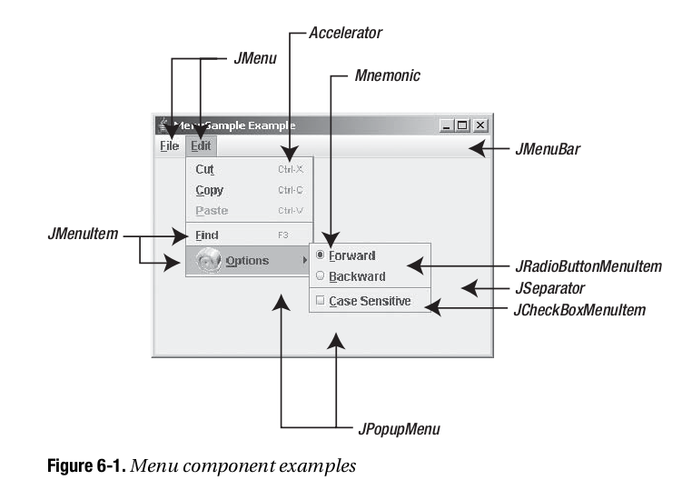
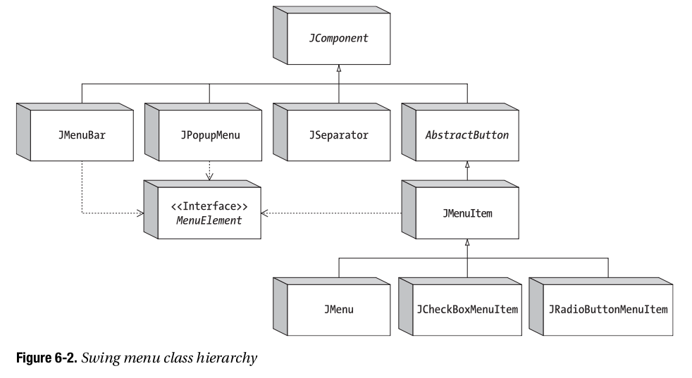
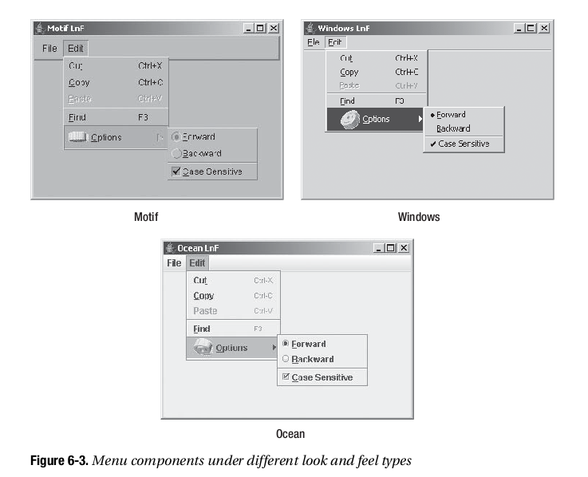
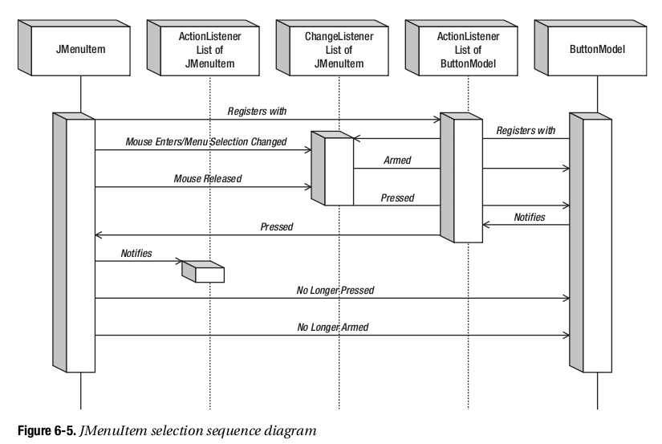
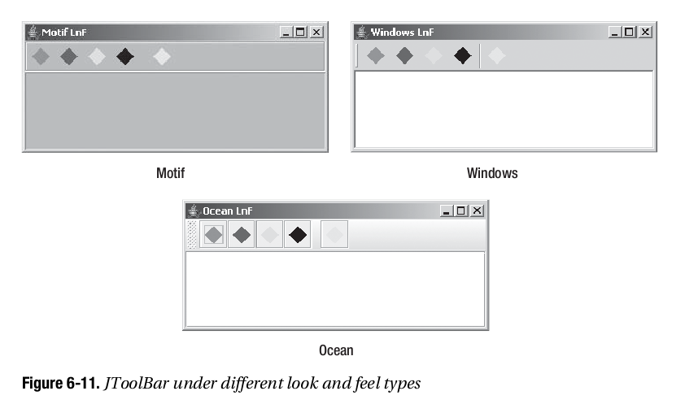

Swing Menus and Toolbars
=======================

本书的前面两章描述了一些低级的Swing组件。本章将会深入Swing面向菜单的组件。菜单与工具栏通过提供一些可视化的命令选项可以使得我们的程序更为友好。尽管Swing组件可以支持多个按键的命令序列，菜单被设计用来提供使用鼠标的图形化选择，而不是通过键盘。

本章将要讨论的菜单组件的使用如下：

-   对于级联菜单，我们可以创建一个JMenu组件，并将其添加到JMenuBar。
-   对于JMenu中的可选菜单，我们可以创建一个JMenuItem组件，并将其添加到JMenu。
-   要创建子菜单，我们可以向JMenu添加一个新的JMenu，并向新菜单添加JMenuItem选项。
-   然后，当一个JMenu被选中时，系统会在JPopupMenu中显示其当前的组件集合。

除了基本的JMenuItem元素，本章将还会讨论其他的菜单项目，例如JCheckBoxMenuItem以及JRadioButtonMenuItem，我们可以将这两个菜单项目放在JMenu中。同时我们还会探讨JSeparator类，他可以将菜单项目进行逻辑分组。我们将会了解如何通过使用JPopupMenu类来为JMenu被选中后出现的弹出菜单，或是任何组件的环境中提供支持。与抽象按钮类似，每一个菜单元素也有一个用于键盘选中的热键与其相关联。我们同进也会了解键盘快捷键支持，从而可以使得用记避免在多级菜单间进行遍历。

除了单个的菜单相关的组件之外，在本章中我们会了解JMenuBar选中模型以及菜单特定的事件相关类。我们要了解的选中模型接口是SingleSelectionModel接口，以及其默认实现DefaultSingleSelectionModel。我们将会探讨菜单特定的监听器以及事件MenuListener/MenuEvent，MenuKeyListener/MenuKeyEvent以及MenuDragMouseListener/MenuDragMouseEvent。另外，我们还会了解使用Popup与PopupFactory创建其他的弹出组件，以及通过JToolBar类使用工具栏。

使用菜单
--------

我们先来了解一个演示菜单组件是如何组合在一起的示例。要开始我们的学习，创建一个具有菜单栏的窗体，如图6-1所示。



这个简单的菜单示例具有下列特性：

-   在菜单栏上是两个普通的菜单：File与Edit。在File菜单下，是我们较为熟悉的New，Open，Close与Exit。在Edit菜单下则是Cut,Copy,Paste与Find以及一个Find选项的子菜单。选项子菜单将包含查找方向子菜单--向前与向后--以及一个大小写敏感的开关。
-   在不同菜单的各种位置，菜单分隔符将选项分逻辑集合。
-   每一个菜单选项都具有一个相关联的热键，通过热键可以进行键盘浏览与选中。热键可以使得用户通过键盘进行菜单选择，例如，在Windows平台下通过按下Alt-F可以打开File菜单。
-   除了键盘热键，与多个选项相关联的击键可以作为键盘快捷键。与热键不同，快捷键可以直接激活一个菜单选项，甚至菜单选项并不可见时也是如此。
-   选项子菜单具有一个与其相关联的图标。尽管在图6-1中只显示了一个图标，所有的菜单组件都可以具有一个图标，除了JSpearator与JPopupMenu组件。

注意，对于这个示例，这些菜单选项并不会完成任何有意义的事情，仅是输出哪一个菜单选项被选中。例如，由Edit菜单中选中Copy选项会显示Selected:
Copy。

列表6-1显示了图6-1中生成示例类的完整代码。

``` java
/**
 * 
 */
package net.ariel.ch06;

import java.awt.EventQueue;
import java.awt.event.ActionEvent;
import java.awt.event.ActionListener;
import java.awt.event.KeyEvent;

import javax.swing.ButtonGroup;
import javax.swing.Icon;
import javax.swing.ImageIcon;
import javax.swing.JCheckBoxMenuItem;
import javax.swing.JFrame;
import javax.swing.JMenu;
import javax.swing.JMenuBar;
import javax.swing.JMenuItem;
import javax.swing.JRadioButtonMenuItem;
import javax.swing.KeyStroke;

/**
 * @author mylxiaoyi
 *
 */
public class MenuSample {

    static class MenuActionListener implements ActionListener {
        public void actionPerformed(ActionEvent event ) {
            System.out.println("Selected: "+event.getActionCommand());
        }
    }
    /**
     * @param args
     */
    public static void main(String[] args) {
        // TODO Auto-generated method stub
        Runnable runner = new Runnable() {
            public void run() {
                MenuActionListener menuListener = new MenuActionListener();
                JFrame frame  = new JFrame("Menu Sample");
                frame.setDefaultCloseOperation(JFrame.EXIT_ON_CLOSE);

                JMenuBar menuBar = new JMenuBar();

                JMenu fileMenu = new JMenu("File");
                fileMenu.setMnemonic(KeyEvent.VK_F);
                menuBar.add(fileMenu);

                JMenuItem newMenuItem = new JMenuItem("New", KeyEvent.VK_N);
                newMenuItem.addActionListener(menuListener);
                fileMenu.add(newMenuItem);

                JMenuItem openMenuItem = new JMenuItem("Open", KeyEvent.VK_O);
                openMenuItem.addActionListener(menuListener);
                fileMenu.add(openMenuItem);

                JMenuItem closeMenuItem = new JMenuItem("Close", KeyEvent.VK_C);
                closeMenuItem.addActionListener(menuListener);
                fileMenu.add(closeMenuItem);

                fileMenu.addSeparator();

                JMenuItem saveMenuItem = new JMenuItem("Save", KeyEvent.VK_S);
                saveMenuItem.addActionListener(menuListener);
                fileMenu.add(saveMenuItem);

                fileMenu.addSeparator();

                JMenuItem exitMenuItem = new JMenuItem("Exit", KeyEvent.VK_X);
                exitMenuItem.addActionListener(menuListener);
                fileMenu.add(exitMenuItem);

                JMenu editMenu  = new JMenu("Edit");
                editMenu.setMnemonic(KeyEvent.VK_E);
                menuBar.add(editMenu);

                JMenuItem cutMenuItem = new JMenuItem("Cut", KeyEvent.VK_T);
                cutMenuItem.addActionListener(menuListener);
                KeyStroke ctrlXKeyStroke = KeyStroke.getKeyStroke("control X");
                cutMenuItem.setAccelerator(ctrlXKeyStroke);
                editMenu.add(cutMenuItem);

                JMenuItem copyMenuItem = new JMenuItem("Copy", KeyEvent.VK_C);
                copyMenuItem.addActionListener(menuListener);
                KeyStroke ctrlCKeyStroke = KeyStroke.getKeyStroke("control C");
                copyMenuItem.setAccelerator(ctrlCKeyStroke);
                editMenu.add(copyMenuItem);

                JMenuItem pasteMenuItem = new JMenuItem("Paste", KeyEvent.VK_P);
                pasteMenuItem.addActionListener(menuListener);
                KeyStroke ctrlVKeyStroke = KeyStroke.getKeyStroke("control V");
                pasteMenuItem.setAccelerator(ctrlVKeyStroke);
                editMenu.add(pasteMenuItem);

                editMenu.addSeparator();

                JMenuItem findMenuItem = new JMenuItem("Find", KeyEvent.VK_F);
                findMenuItem.addActionListener(menuListener);
                KeyStroke f3KeyStroke = KeyStroke.getKeyStroke("F3");
                findMenuItem.setAccelerator(f3KeyStroke);
                editMenu.add(findMenuItem);

                JMenu findOptionsMenu = new JMenu("Options");
                Icon atIcon = new ImageIcon("at.gif");
                findOptionsMenu.setIcon(atIcon);
                findOptionsMenu.setMnemonic(KeyEvent.VK_O);

                ButtonGroup directionGroup = new ButtonGroup();

                JRadioButtonMenuItem forwardMenuItem = new JRadioButtonMenuItem("Forward", true);
                forwardMenuItem.addActionListener(menuListener);
                forwardMenuItem.setMnemonic(KeyEvent.VK_F);
                findOptionsMenu.add(forwardMenuItem);
                directionGroup.add(forwardMenuItem);

                JRadioButtonMenuItem backMenuItem = new JRadioButtonMenuItem("Back");
                backMenuItem.addActionListener(menuListener);
                backMenuItem.setMnemonic(KeyEvent.VK_B);
                findOptionsMenu.add(backMenuItem);
                directionGroup.add(backMenuItem);

                findOptionsMenu.addSeparator();

                JCheckBoxMenuItem caseMenuItem = new JCheckBoxMenuItem("Case Sensitive");
                caseMenuItem.addActionListener(menuListener);
                caseMenuItem.setMnemonic(KeyEvent.VK_C);
                findOptionsMenu.add(caseMenuItem);
                editMenu.add(findOptionsMenu);

                frame.setJMenuBar(menuBar);
                frame.setSize(350, 250);
                frame.setVisible(true);

            }
        };
        EventQueue.invokeLater(runner);
    }

}
```

### 菜单类层次结构

现在我们已经了解如何为程序创建级联菜单，我们应该已经了解了使用Swing菜单组件所涉及到的内容。为了表达更为清晰，图6-2显示了所有的Swing菜单组件内部是如何关联的。



图6-2所显示的最重要的概念就是作为JComponent的子类的所有Swing菜单元素都是AWT组件。我们可以将JMenuItem，JMenu以及JMenuBar组件放在AWT组件可以放置的位置，而仅不是在窗体上。另外，因为JMenuItem是由AbstractButton继承而来的，JMenuItem及其子类继承了各种图标以及HTML文本标签的支持，正如第5章所述。

除了是基本的类层次结构的一部分以外，每一个可选择的菜单组件都实现了MenuElement接口。这个接口描述了支持键盘与鼠标浏览所必须的菜单行为。预定义的菜单组件已经实现了这种行为，所以我们不必自己实现。但是如我们对这个接口是如何工作的比较感兴趣，可以查看本章中的“MenuElement接口”一节。

下面我们来了解一下不同的Swing菜单组件。

### JMenuBar类

Swing的菜单栏组件是JMenuBar。其操作要求我们使用具有JMenuItem元素的JMenu元素来填充菜单栏。然后我们将菜单栏添加到JFrame或是其他的需要菜单栏的用户界面组件上。菜单然后会依赖于SingleSelectionModel的帮助来确定在其选中之后显示或是发送哪一个JMenu。

**创建JMenuBar组件**

JMenuBar具有一个无参数的构造函数：public
JMenuBar()。一旦我们创建了菜单栏，我们就可以使用JApplet，JDialog，JFrame，JInternalFrame或是JRootPane的setJMenuBar()方法将其添加到一个窗口。

``` java
JMenuBar menuBar = new JMenuBar();
// Add items to it
...
JFrame frame = new JFrame("MenuSample Example");
frame.setJMenuBar(menuBar);
```

通过系统提供的观感类型，通过setJMenuBar()方法，菜单栏显示在窗体的上部，窗体标题的下部（如果有）。其他的观感类型，例如Macintosh的Aqua，会将菜单栏放在其他的位置。

我们也可以使用Container的add()方法将JMenuBar添加到窗口。当通过add()方法添加时，JMenuBar会通过Container的布局管理器进行管理。

在我们拥有一个JMenuBar之后，要使用其余的菜单类来填充菜单栏。

**向菜单栏添加与移除菜单**

我们需要将JMenu对象添加到JMenuBar。否则，所显示只是没有任何内容的边框。向JMenuBar添加菜单只有一个方法：

public JMenu add(JMenu menu)

在默认情况下，连续添加的菜单会由左向右显示。这会使得第一个添加到的菜单会是最左边的菜单，而最后添加的菜单则是最右边的菜单。在这两者之间添加的菜单则会以其添加的顺序进行显示。例如，列表6-1中的示例程序，菜单的添加顺序如下：

``` java
JMenu fileMenu = new JMenu("File");
menuBar.add(fileMenu);
JMenu editMenu = new JMenu("Edit");
menuBar.add(editMenu);
```

除了JMenuBar的add()方法以外，由Container继承的多个重载的add()方法可以菜单的位置进行更多的控制。其中最有趣的就是add(Component
component, int
index)方法，这个方法可以使得我们指定新的JMenu的显示位置。使用第二个add()方法可以使得我们以不同的顺序将File与Edit的JMenu组件放置在JMenuBar中，但是会得到相同的结果：

``` java
menuBar.add(editMenu);
menuBar.add(fileMenu, 0);
```

如果我们已经向JMenuBar添加了一个JMenu组件，我们可以使用remove(Component
component)或是由Container继承的remove(int index)方法来移除菜单：

``` java
bar.remove(edit);
bar.remove(0);
```

**JMenuBar属性**

表6-1显示了JMenuBar的11个属性。其中的半数属性是只读的，只允许我们查询当前的菜单栏状态。其余的属性允许我们通过确定菜单栏边框是否绘制以及选择菜单元素之间的空白尺寸来修改菜单栏的外观。selected属性与selectionModel可以控制菜单栏上当前被选中的菜单是哪一个。当被选中的组件设置为菜单栏上的一个菜单，菜单组件会以弹出菜单的方式显示在窗口中。

  ---------------------- ------------------------- -------------
  属性名                 数据类型                  可访问性
  accessibleContext      AccessibleContext         只读
  borderPainted          boolean                   读写
  component              Component                 只读
  helpMenu               JMenu                     只读
  margin                 Insets                    读写
  menuCount              int                       只读
  selected               boolean/Component         读写
  selectionModel         SingleSelectionModel      读写
  subElements            MenuElement\[\]           只读
  UI                     MenuBarUI                 读写
  UIClassID              String                    只读
  ---------------------- ------------------------- -------------

Table: JMenuBar属性

**自定义JMenuBar观感**

每一个预定义的Swing观感都为JMenuBar以及菜单组件提供了一个不同的外观以及一个默认的UIResource值集合。图6-3显示了预安装的观感类型集合的菜单组件外观：Motif，Windows以及Ocean。



考虑JMenuBar的特定外观，表6-2显示了UIResource相关属性的集合。JMenuBar组件有12个属性。

  --------------------------- --------------
  属性字符串                  对象类型
  MenuBar.actionMap           ActionMap
  MenuBar.background          Color
  MenuBar.border              Border
  MenuBar.borderColor         Color
  MenuBar.darkShadow          Color
  MenuBar.font                Font
  MenuBar.foreground          Color
  MenuBar.gradient            List
  MenuBar.highlight           Color
  MenuBar.shadow              Color
  MenuBar.windowBindings      Object\[\]
  MenuBarUI                   String
  --------------------------- --------------

Table: JMenuBar UIResource元素

如果我们需要一个垂直菜单栏，而不是一个水平菜单栏，我们只需要简单的改变菜单栏组件的LayoutManager。例如0行1列的GridLayout可以完成这个工作，如下面的示例所示，因为由于JMenu的添加，行数会无限增长：

``` java
import java.awt.*;
import javax.swing.*;
public class VerticalMenuBar extends JMenuBar {
  private static final LayoutManager grid = new GridLayout(0,1);
  public VerticalMenuBar() {
    setLayout(grid);
  }
}
```

将图6-1所示的菜单栏移动到BorderLayout的东侧，并使用VerticalMenuBar来替换JMenuBar所产生的结果如图6-4所示。尽管垂直菜单栏在这里看起来并不舒服，但是在窗口的右侧（或左侧）更需要使得菜单项目垂直堆放而不是水平堆放。然而，我们也许会需要修改MenuBar.border属性来修改边框。


### SingleSelectionModel接口

SingleSelectionModel将索引描述为一个整数索引的数据结构，其中的元素可以被选中。接口后面的数据结构类似于数据或是向量，其中重复访问相同位置可以获得相同的对象。SingleSelectionModel接口是JMenuBar与JPopupMenu的选择模型。在JMenuBar中，接口描述了当前被选中的需要绘制的JMenu。在JPopupMenu中，接口描述了当前被选中的JMenuItem。

SingleSelectionModel的接口定义如下：

``` java
public interface SingleSelectionModel {
  // Listeners
  public void addChangeListener(ChangeListener listener);
  public void removeChangeListener(ChangeListener listener);
  // Properties
  public int getSelectedIndex();
  public void setSelectedIndex(int index);
  public boolean isSelected();
  // Other Methods
  public void clearSelection();
}
```

正如我们所看到的，除了选择索引外，接口需要维护一个当选择索引变化时需要通知的ChangeListener列表。

默认的Swing提供的SingleSelectionModel实现是DefaultSingleSelectionModel类。对于JMenuBar与JPopupMenu，我们通常并不需要修改由其默认实现所获得的选择模型。

DefaultSingleSelectionModel实现管理一个ChangeListener对象列表。另外，模型使用-1来标识当前并没有任何内容被选中。当选中的索引为-1时，isSelected()会返回false；否则，此方法会返回true。当选中索引变化时，所注册的ChangeListener对象会得到通知。

### JMenuItem类

JMenuItem组件是用户可以在菜单栏上选择的预定义组件。作为AbstractButton的子类，JMenuItem是一个特殊的按钮组件，其行为类似于JButton。除了作为AbstractButton的子类，JMenuItem类共享JButton的数据模型（ButtonModel接口与DefaultButtonModel实现）。

**创建JMenuItem组件**

JMenuItem有六个构造函数。这些构造函数可以使得我们初始化菜单项的字符串或是图标以及菜单项的热键。并不存在显式的构造函数允许我们在创建时设置所有三个选项，除非我们将其作为Action的一部分。

``` java
public JMenuItem()
JMenuItem jMenuItem = new JMenuItem();

public JMenuItem(Icon icon)
Icon atIcon = new ImageIcon("at.gif");
JMenuItem jMenuItem = new JMenuItem(atIcon);

public JMenuItem(String text)
JMenuItem jMenuItem = new JMenuItem("Cut");

public JMenuItem(String text, Icon icon)
Icon atIcon = new ImageIcon("at.gif");
JMenuItem jMenuItem = new JMenuItem("Options", atIcon);

public JMenuItem(String text, int mnemonic)
JMenuItem jMenuItem = new JMenuItem("Cut", KeyEvent.VK_T);

public JMenuItem(Action action)
Action action = ...;
JMenuItem jMenuItem = new JMenuItem(action);
```

热键可以使得我们通过键盘浏览选择菜单。例如，在Windows平台上，如果菜单项出现在已打开的Edit菜单中，我们可以通过简单的按下Alt-T来选中Cut菜单。菜单项的热键通常以菜单文本标签中的下划线形式出现。然而，如果字符并没有出现在文本标签中，或者是没有文本标签，用户通常并不会得到明显的提示。字符是通过java.awt.event.KeyEvent类中的不同常量来标识的。

其他的平台也许会提供其他的选中热键。在Unix平台下，通常是Alt键；而在Macintosh平台下则是Command键。

**JMenuItem属性**

JMenuItem有多个属性。大约有100个属性是通过各种超类来继承的。表6-3显示了JMenuItem特定的10个属性。

  --------------------------- ---------------------------- -------------
  属性名                      数据类型                     访问性
  accelerator                 KeyStroke                    读写绑定
  accessibleContext           AccessibleContext            只读
  armed                       boolean                      读写
  component                   Component                    只读
  enabled                     boolean                      只写绑定
  menuDragMouseListeners      MenuDragMouseListener\[\]    只读
  menuKeyListeners            MenuKeyListener\[\]          只读
  subElements                 MenuElement\[\]              只读
  UI                          MenuElementUI                只写绑定
  UIClassID                   String                       只读
  --------------------------- ---------------------------- -------------

Table: JMenuItem属性

其中比较有趣的一个属性就是accelerator。正如第2章所解释的，KeyStroke是一个工厂类，可以使得我们基于按键与标识符组合创建实例。例如，下面的代码语句来自于本章列表6-1中的示例，将Ctrl-X作为快捷键与一个特定的菜单项相关联：

``` java
KeyStroke ctrlXKeyStroke = KeyStroke.getKeyStroke("control X");
cutMenuItem.setAccelerator(ctrlXKeyStroke);
```

只读的component与subElement属性是JMenuItem所实现的MenuElement接口的一部分。component属性是菜单项的渲染器（JMenuItem本身）。subElement属性是空的（也就是一个空的数组，而不是null），因为JMenuItem并没有子类。

**处理JMenuItem事件**

我们可以在JMenuItem内部使用至少五种不同的方法来处理事件。组件继承了允许我们通过AbstractButton的ChangeListener与ActionListener注册的方法来触发ChangeEvent与ActionEvent的能力。中软皮，JMenuItem组件支持当MenuKeyEvent与MenuDragMouseEvent事件发生时注册MenuKeyListener与MenuDragMouseListener对象。这些技术会在后面的章节中进行讨论。第五种方法是向JMenuItem的构造函数传递Action，其作用类似于一种特殊的使用ActionListener监听的方法。要了解更多的关于使用Action的内容，可以查看本章稍后的“JMenu类”一节中关于在菜单中使用Action对象的讨论。

**使用ChangeListener监听JMenuItem事件**

通常我们并不会向JMenuItem注册ChangeListener。然而，演示一个理想的例子助于更为清晰的解释JMenuItem关于其ButtonModel数据模型的变化。所考虑的事件变化是与JButton相同的arm,press与select。然而，他们的名字会有一些迷惑，因为所选择的模型属性并没有进行设置。

当鼠标略过菜单选项并且菜单变为选中时，JMenuItem是armed。当用户释放其上的鼠标按钮时，JMenuItem是pressed。紧随按下之后，菜单项会变为未按下与unarmed。在菜单项变为按下与未按下之间，AbstractButton会得到模型变化的通知，从而使得菜单项所注册的ActionListener对象得到通知。一个普通JMenuItem的按钮模型不会报告被选中。如果我们没有选择而将鼠标移动到另一个菜单项上，则第一个菜单项会自动变化unarmed。为了有助于我们更好的理解不同的变化，图6-5显示了一个序列图。



**使用ActionListener监听JMenuItem事件**

关联到JMenuItem更好的监听器是ActionListener，或者是向构造函数传递一个Action。他可以使得我们确定哪一个菜单项被选中。当用户在作为打开菜单一部分的JMenuItem上释放鼠标按钮时，所注册的ActionListener对象会得到通知。如果用户通过键盘（箭头键或是热键）或是按下菜单快捷键来选中菜单时，所注册的监听器也会得到通知。

当我们希望菜单被选中时发生某个动作，我们必须为每一个JMenuItem添加一个ActionListener。并不存在一个自动的方法使得我们可以为JMenu或是JMenuBar注册一个ActionListener从而使得其所包含的JMenuItem对象通知一个ActionListener。

列表6-1中的示例程序为每一个JMenuItem关联了一个相同的ActionListener：

``` java
class MenuActionListener implements ActionListener {
  public void actionPerformed(ActionEvent e) {
    System.out.println("Selected: " + e.getActionCommand());
  }
}
```

然而更为通常的是，我们为每一个菜单项关联一个不同的动作，从而每一个菜单项可以进行不同的响应。

提示：我们并不需要为组件创建一个自定义的ActionListener并进行注册，我们可以创建一个自定义的Action，并且在组件上调用setAction()方法。

**使用MenuKeyListener监听JMenuItem事件**

MenuKeyEvent是用户界面类内部为JMenu与JMenuItem所用的特殊的KeyEvent，使得组件可以监听何时其键盘热键被按下。要监听这种键盘输入，每一个菜单组件注册一个MenuKeyListener，从而监听相应的输入。如果键盘热键被按下，事件就会被处理，从而不会再被传送到所注册的监听器。如果键盘热键没有被按下，所注册的键盘监听器（而不是菜单键监听器）就会得到通知。

MenuKeyListener接口定义如下：

``` java
public interface MenuKeyListener extends EventListener {
  public void menuKeyPressed(MenuKeyEvent e);
  public void menuKeyReleased(MenuKeyEvent e);
  public void menuKeyTyped(MenuKeyEvent e);
}
```

通常我们并不需要自己注册这种类型的监听器对象，尽管如果我们希望我们仍可以这样做。如果我们确定这样做，并且如果MenuKeyEvent发生（也就是一个键被按下/释放），JMenuBar中的每一个JMenu都会得到通知，就如同打开菜单中的每一个JMenuItem（或是子类）都有一个注册的MenuKeyListener。这包括禁止的菜单项，从而他们可以处理按下的热键。MenuKeyEvent类的定义如下：

``` java
public class MenuKeyEvent extends KeyEvent {
  public MenuKeyEvent(Component source, int id, long when, int modifiers,
    int keyCode, char keyChar, MenuElement path[], MenuSelectionManager mgr);
  public MenuSelectionManager getMenuSelectionManager();
  public MenuElement[] getPath();
}
```

确定当前选择路径是MenuSelectionManager的工作。选择路径是由顶层的JMenuBar上的JMenu到所选中的组件的菜单元素集合。对于大多数情况而言，管理器在幕后工作，而我们无需担心。

**使用MenuDragMouseListener监听JMenuItem事件**

与MenuKeyEvent类似，MenuDragMouseEvent也是用户界面类为JMenu与JMenuBar在内部所用的特殊的事件类型。正如其名字所显示的，MenuDragMouseEvent是一种特殊类型的MouseEvent。通过监听鼠标何时在打开的菜单中移动，用户界面类使用监听器来维护选择路径，从而确定当前选中的菜单项。其定义如下：

``` java
public interface MenuDragMouseListener extends EventListener {
  public void menuDragMouseDragged(MenuDragMouseEvent e);
  public void menuDragMouseEntered(MenuDragMouseEvent e);
  public void menuDragMouseExited(MenuDragMouseEvent e);
  public void menuDragMouseReleased(MenuDragMouseEvent e);
}
```

与MenuKeyListener类似，通常我们并不需要亲自监听这一事件。如果我们比较感兴趣一个菜单或是子菜单何时显示，要注册的更好的监听器是MenuListener，这个监听器可以注册到JMenu，但是并不可以注册到单个的JMenuItem。我们将会在描述JMenu的下一节了解到这一点。

MenuDragMouseEvent类的定义，MenuDragMouseListener方法的参数如下：

``` java
public class MenuDragMouseEvent extends MouseEvent {
  public MenuDragMouseEvent(Component source, int id, long when, int modifiers,
    int x, int y, int clickCount, boolean popupTrigger, MenuElement path[],
    MenuSelectionManager mgr);
  public MenuSelectionManager getMenuSelectionManager();
  public MenuElement[] getPath();
}
```

**自定义JMenuItem观感**

与JMenuBar类似，预定义的观感类型提供了不同的JMenuItem外观以及默认的UIResource值集合。图6-3显示了预安装集合的JMenuItem的外观：Motif,Windows与Ocean。

表6-4显示了JMenuItem的UIResource相关属性集合。JMenuItem组件提供了20个不同的属性。

  -------------------------------------------- --------------
  属性字符串                                   对象类型
  MenuItem.acceleratorDelimiter                String
  MenuItem.acceleratorFont                     Font
  MenuItem.acceleratorForeground               Color
  MenuItem.acceleratorSelectionForeground      Color
  MenuItem.actionMap                           ActionMap
  MenuItem.arrowIcon                           Icon
  MenuItem.background                          Color
  MenuItem.border                              Border
  MenuItem.borderPainted                       Boolean
  MenuItem.checkIcon                           Icon
  MenuItem.commandSound                        String
  MenuItem.disabledForeground                  Color
  MenuItem.font                                Font
  MenuItem.foreground                          Color
  MenuItem.margin                              Insets
  MenuItem.opaque                              Boolean
  MenuItem.selectionBackground                 Color
  MenuItem.selectionForeground                 Color
  MenuItem.textIconGap                         Integer
  MenuItemUI                                   String
  -------------------------------------------- --------------

Table: JMenuItem UIResource元素

### JMenu类

JMenu组件是放置在JMenuBar上的基本菜单项。当一个JMenu被选中时，菜单在JPopupMenu内显示所包含的菜单项。对于JMenuItem，JMenu的数据模型则是一个ButtonModel实现，或者更为特定的，DefaultButonModel。

**创建JMenu组件**

JMenu有四个构造函数可以使得我们初始化菜单的字符串标签：

``` java
public JMenu()
JMenu jMenu = new JMenu();
public JMenu(String label)
JMenu jMenu = new JMenu("File");
public JMenu(String label, boolean useTearOffs)
public JMenu(Action action)
Action action = ...;
JMenu jMenu = new JMenu(action);
```

其中一个构造函数用于tear-off菜单。然而，tear-off菜单当前并不被支持；所以其参数会被忽略。第四个构造函数使用Action中的属性来填充菜单。

注意：所谓tear-off菜单是显示在一个窗口中并且在选择之后仍然保持打开，而不是自动关闭。

**向JMenu添加菜单项**

一旦我们有了JMenu，我们需要向其添加JMenuItem对象；否则，菜单不会显示任何选择。有五个方法可以向JMenu添加所定义的菜单项，一个用于添加分隔符：

``` java
public JMenuItem add(JMenuItem menuItem);
public JMenuItem add(String label);
public Component add(Component component);
public Component add(Component component, int index);
public JMenuItem add(Action action);
public void addSeparator();
```

在本章前面的列表6-1中，所有的JMenuItem组件是通过第一个add()方法添加到JMenu组件的。为了简便起见，我们可以将JMenuItem的文本标签传递给JMenu的add()方法。这个方法会创建菜单项，设置其标签，并且传回新菜单项组件。然后我们可以将菜单项事件处理器绑定到这个新获得的菜单项。第三个add()方法表明我们可以在JMenu上放置任意的Component的，而不仅是JMenuItem。第四个add()方法允许我们按位置放置组件。最后一个add()方法变体，带有一个Action参数，将会在下一节进行讨论。

我们可以使用JMenu的addSeparator()方法添加分隔栏。例如，在列表6-1中，File菜单是使用类似下面的代码来创建的：

``` java
JMenu fileMenu = new JMenu("File");
JMenuItem newMenuItem = new JMenuItem("New");
fileMenu.add(newMenuItem);
JMenuItem openMenuItem = new JMenuItem("Open");
fileMenu.add(openMenuItem);
JMenuItem closeMenuItem = new JMenuItem("Close");
fileMenu.add(closeMenuItem);
fileMenu.addSeparator();
JMenuItem saveMenuItem = new JMenuItem("Save");
fileMenu.add(saveMenuItem);
fileMenu.addSeparator();
JMenuItem exitMenuItem = new JMenuItem("Exit");
fileMenu.add(exitMenuItem);
```

注意，addSpeparator()调用包围了添加Save菜单项的调用。

除了在菜单的结束处添加菜单项以外，我们可以将菜单项插入在指定的位置或是将分隔符插入在指定的位置，如下所示：

``` java
public JMenuItem insert(JMenuItem menuItem, int pos);
public JMenuItem insert(Action a, int pos);
public void insertSeparator(int pos);
```

当一个菜单被添加到JMenu后，他就被加入了内部的JPopupMenu。

**菜单中使用Action对象**

在第2章中描述了Aciton接口及其相关联的类。Action是ActionListener接口的扩展，并且包含用于自定义与其实现相关联的组件的一些特殊属性。

借助于AbstractAction这现，我们可以很容易的定义文本标签，图标，热键，工具提示文本，允许状态，以及一个与组件相分离的ActionListener。然后我们可以使用相关联的Action创建组件，并且不必为组件指定文本标签，图标，热键，工具提示文本，允许状态，或是ActionListener，因为这些属性来自Action。要了解详细的描述，可以参考第2章。

为了演示的需要，列表6-2创建了AbstractAction的一个特定实现，并且将其多次添加到JMenu中。一旦Action被添加到JMenu，选择JMenuItem将会借助JOptionPane类显示一个弹出对话框，我们会在第9章讨论这一主题
。

``` java
import java.awt.*;
import java.awt.event.*;
import javax.swing.*;
public class ShowAction extends AbstractAction {
  Component parentComponent;
  public ShowAction(Component parentComponent) {
    super("About");
    putValue(Action.MNEMONIC_KEY, new Integer(KeyEvent.VK_A));
    this.parentComponent = parentComponent;
  }
  public void actionPerformed(ActionEvent actionEvent) {
    Runnable runnable = new Runnable() {
       public void run() {
         JOptionPane.showMessageDialog(
           parentComponent, "About Swing",
           "About Box V2.0", JOptionPane.INFORMATION_MESSAGE);
       }
    };
    EventQueue.invokeLater(runnable);
  }
}
```

下面的代码为列表6-1中的示例程序中的File与Edit菜单创建了一个ShowAction与一个JMenuItem。无需显示的设置菜单项属性，他会具有一个About文本标签与一个热键，并且会执行所定义的actionPerformed()方法作为其ActionListener。事实上，我们可以创建Action一次，然后可以将其关联到所需要的多个地方（或者是其他支持添加Action对象的组件）。

``` java
Action showAction = new ShowAction(aComponent);
JMenuItem fileAbout = new JMenuItem(showAction);
fileMenu.add(fileAbout);
JMenuItem editAbout = new JMenuItem(showAction);
editMenu.add(editAbout);
```

使用AbstractAction的副作用就是通过setEnabled(false)方法禁止Action时，相应的，会禁止所有由其创建的组件。

**JMenu属性**

除了由JMenu继承的100多个属性以外，表6-5显示了16个JMenu特定的属性。其中的一些属性覆盖了继承属性的行为。例如，accelerator属性的设置方法会在我们尝试为这个属性赋值时抛出错误。换句话说，快捷键并不为JMenu对象所支持。其余的属性描述了JMenu对象的当前状态及其所包含的菜单组件。

  ----------------------- ---------------------- -------------
  属性名                  数据类型               访问性
  accelerator             KeyStroke              只写
  accessibleContext       AccessibleContext      只读
  component               Component              只读
  delay                   int                    读写
  itemCount               int | 只读             
  menuComponentCount      int                    只读
  menuComponents          Component\[\]          只读
  menuListeners           MenuListener\[\]       只读
  model                   ButtonModel            只写绑定
  popupMenu               JPopupMenu             只读
  popupMenuVisible        boolean                读写
  selected                boolean                读写
  subElements             MenuElement\[\]        只读
  tearOff                 boolean                只读
  topLevelMenu            boolean                只读
  UIClassID               String                 只读
  ----------------------- ---------------------- -------------

Table: JMenu属性

delay属性表示在选择JMenu与发出JPopupMenu之间所逝去的时间。默认情况这个值为0,表示会立即显示子菜单。尝试将这个值设置负值会抛出IllegalArgumentException。

**选择菜单组件**

通常我们并不需要监听JMenu组件的选择。我们只需要监听单个的JMenuItem组件的选择。然而，与JMenuItem相比，我们会对JMenu所用的ChangeEvent的不同方法感兴趣。另外，当一个菜单被弹出或是关闭时，MenuEvent会通知我们。

**使用ChangeListener监听JMenu事件**

与JMenuItem类似，如果我们对于修改底层的ButtonModel比较感兴趣，我们可以向JMenu注册ChangeListener。奇怪的是，JMenu的ButtonModel的唯一的状态改变就是selected属性。当被选中时，JMenu显示其菜单项。当没有被选中时，弹出菜单会消失。

**使用MenuListener监听JMenu事件**

监听弹出菜单何时显示或是隐藏的更好的方法是就是向JMenu对象注册MenuListener对象。其定义如下：

``` java
public interface MenuListener extends EventListener {
  public void menuCanceled(MenuEvent e);
  public void menuDeselected(MenuEvent e);
  public void menuSelected(MenuEvent e);
}
```

通过注册MenuListener，当JMenu在弹出菜单打开之前选中时，我们会得到通知。这可以使得我们自定义其菜单选项。除了得到相关联的弹出菜单何时被弹出的通知，当菜单被取消选中以及菜单被关闭时我们也会得到通知。正如下面的MenuEvent类定义所显示的，事件所提供的唯一信息就是源（菜单）：

``` java
public class MenuEvent extends EventObject {
  public MenuEvent(Object source);
}
```

提示：如果我们选择动态自定义JMenu上的项，在确保调用revalidate()，因为组件会在我们更新显示之前一直等待。

**自定义JMenu观感**

与JMenuBar和JMenuItem类似，预定义的观感提供了不同的JMenu外观以及默认的UIResource值集合。图6-3显示了预安装的观感类型集合的JMenu对象外观。

表6-6显示了JMenu的UIResource相关属性的集合。对于JMenu组件，有30个不同的属性。

  ----------------------------------------- --------------
  属性字符串                                对象类型
  menu                                      Color
  Menu.acceleratorDelimiter                 String
  Menu.acceleratorFont                      Font
  Menu.acceleratorForeground                Color
  Menu.acceleratorSelectionForeground       Color
  Menu.ActionMap                            ActionMap
  Menu.arrowIcon                            Icon
  Menu.background                           Color
  Menu.border                               Border
  Menu.borderPainted                        Boolean
  Menu.checkIcon                            Icon
  Menu.delay                                Integer
  Menu.disabledForeground                   Color
  Menu.font                                 Font
  Menu.foreground                           Color
  Menu.margin                               Insets
  Menu.menuPopupOffsetX                     Integer
  Menu.menuPopupOffsetY                     Integer
  Menu.opaque                               Boolean
  Menu.selectionBackground                  Color
  Menu.selectionForeground                  Color
  Menu.shortcutKeys                         int\[\]
  Menu.submenuPopupOffsetX                  Integer
  Menu.submenuPopupOffsetY                  Integer
  Menu.textIconGap                          Integer
  Menu.useMenuBarBackgroundForTopLevel      Boolean
  menuPressedItemB                          Color
  menuPressedItemF                          Color
  menuText                                  Color
  MenuUI                                    String
  ----------------------------------------- --------------

Table: JMenu UIResource元素

### JSeparator类

JSeparator类是一种特殊的组件，他在JMenu上提供分隔符。JPopupMenu与JToolBar类也支持分隔，但是每一个都使用JSeparator类的相应子类。除了可以放置在菜单上以外，JSeparator类也可以放置在任何我们希望使用水平或是垂直线来分隔屏幕不同区域的地方。

JSeparator是一个严格的可视化组件，所以，他没有数据模型。

**创建JSeparator组件**

要为菜单创建一个分隔，我们并不直接创建一个JSeparator，尽管我们可以这样做。相反，我们调用JMenu的addSeparator()方法，而菜单会创建分隔符并将其添加为下一个菜单项。他是一个JSeparator（不是JMenuItem子类）的事实是隐藏的。JMenu还有一个insertSeparator(int
index)方法，这个方法可以使得我们在菜单上指定的位置添加分隔，这并不必须是下一个位置。

如果我们希望在菜单以外使用JSeparator（例如，在布局中分隔两个面板），我们应该使用JSeparator的两个构造函数：

``` java
public JSeparator()
JSeparator jSeparator = new JSeparator();
public JSeparator(int orientation)
JSeparator jSeparator = new JSeparator(JSeparator.VERTICAL);
```

这两个构造函数使得我们可以创建一个水平或是垂直分隔。如果没有指定方向，则为水平方向。如果我们希望显示式指定方向，我们可以使用JSeparator的常量HORIZONTAL或是VERTICAL。

**JSeparator属性**

在我们拥有JSeparator以外，我们就可以像其他的组件一样将其添加到屏幕中。组件的初始维度是空的（宽度与高度均为0），所以如果屏幕的布局管理器询问组件的尺寸应是多少，分隔符将会回复他不需要空间。另一方面，如果布局管理器提供一定量的空间，如果方向合适则分隔就会使用这个空间。例如，将一个水平JSeparator添加到BorderLayout面板的北侧则会在屏幕上绘制一个分隔线。然而，如果将水平JSeparator添加到相同面板的东侧则不会绘制任何内容。对于垂直JSeparator，其行为则是相反的：北侧将是空的，而在东侧则会出现垂直线。

表6-7显示了JSeparator的四个属性。

  ---------------------- ---------------------- -------------
  属性名                 数据类型               访问性
  accessibleContext      AccessibleContext      只读
  orientation            int                    读写绑定
  UI                     SeparatorUI            读写绑定
  UIClassID              String                 只读
  ---------------------- ---------------------- -------------

Table: JSeparator属性

**自定义JSeparator观感**

预安装的观感类型集合下的JSeparator外观以及其他的菜单组件显示在图6-3中。

表6-8列出了JSeparator的UIResource相关属性集合。对于JSeparator组件，有五个不同的属性。

  ------------------------- -------------
  属性字符串                对象类型
  Separator.background      Color
  Separator.foreground      Color
  Separator.insets          Insets
  Separator.thickness       Integer
  SeparatorUI               String
  ------------------------- -------------

Table: JSeparator UIResource元素

### JPopupMenu类

JPopupMenu组件是弹出菜单组件的容器，可以显示在任何地方并且为JMenu所支持。当一个编程者定义的触发事件发生时，我们显示JPopupMenu，并且菜单显示所包含的菜单组件。与JMenuBar类似，JpopupMenu使用SingleSelectionModel来管理当前被选中的元素。

**创建JpopupMenu组件**

JPopupMenu有两个构造函数：

``` java
public JPopupMenu()
JPopupMenu jPopupMenu = new JPopupMenu();
public JPopupMenu(String title)
JPopupMenu jPopupMenu = new JPopupMenu("Welcome");
```

如果需要，只有一个函数允许我们初始化菜单标题。标题的处理方式会依赖于所安装的观感。当前安装的观感会忽略标题。

**向JPopupMenu添加菜项**

与JMenu类似，一旦我们有了JPopupMenu，我们需要向其添加菜单项；否则，菜单将会是空的。有三个JPopupMenu方法可以添加菜单项，一个用于添加分隔符。

``` java
public JMenuItem add(JMenuItem menuItem);
public JMenuItem add(String label);
public JMenuItem add(Action action);
public void addSeparator();
```

另外还有一个由Container所继承的add()方法可以用于添加通常的AWT组件：

``` java
public Component add(Component component);
```

添加菜单项的通常方法是使用第一个add()方法。我们独立于弹出菜单创建菜单项，包含其行为行定，然后将其关联到菜单。使用第二个add()方法，我们必须将事件处理器关联到由方法返回的菜单；否则，当被选中时菜单并不会响应。下面的代码显示了两种方法。我们使用哪一种方法完全依赖于我们的喜好。可视化编程环境，例如JBuilder，会使用第一种。因为第一种方法并不是十分复杂，如果不是全部，绝大多数的程序员应该使用第一种方法。

``` java
JPopupMenu popupenu = new JPopupMenu();
ActionListener anActionListener = ...;
// The first way
JMenuItem firstItem = new JMenuItem("Hello");
firstItem.addActionListener(anActionListener);
popupMenu.add(firstItem);
// The second way
JMenuItem secondItem = popupMenu.add("World");
secondItem.addActionListener(anActionListener);
```

使用Action来创建与JPopupMenu结合使用的菜单项的方式类似于JMenu。然而，依据JPopupMenu类的Javadoc，并不鼓励使用add()方法的Action变体。相反，可以将Action传递给JMenuItem的构造函数，或者是使用setAction()方法进行配置，然后将其添加到JPopupMenu。为什么这个方法没有被deprecated并不清楚。

最后，我们可以使用addSeparator()方法添加分隔。

除了在菜单尾部添加菜单项，我们可以在指定的位置添加菜单项，或者是在指定的位置添加分隔。

``` java
public JMenuItem insert(Component component, int position);
public JMenuItem insert(Action action, int position);
```

与JMenu不同，并不存在insertSeparator()方法。但是我们可以使用由Container继承的add(Component
component, int
position)方法。如果我们希望移除组件，可以使用JPopupMenu特定的remove(Component
component)方法。

**显示JPopupMenu**

与JMenu不同，简单的组装弹出菜单并不够。我们需要将弹出菜单与合适的组件相关联。在Swing
5.0版本之前，我们需要添加事件处理代码来触发弹出菜单的显示。现在，我们所需要做的就是为我们希望关联弹出菜单的组件调用setComponentPopupMenu()方法。当平台特定的触发事件发生时，弹出菜单会自动显示。

我们只需要简单的创建JPopupMenu的实例，并将其关联到我们希望显示弹出菜单的组件，如下所示：

``` java
JPopupMenu popupMenu = ...;
aComponent.setComponentPopupMenu(popupMenu);
```

对于弹出菜单比较重要的JComponent方法主要有getComponentPopupMenu(),
setComponentPopupMenu(), getInheritsPopupMenu(),
setInheritsPopupMenu()以及getPopupLocation()方法。setInheritsPopupMenu()方法会接受一个boolean参数。当为true时，并没有直接为组件设置组件弹出菜单，则会查找父容器用于弹出菜单。

**JPopupMenu属性**

表6-9列出了JPopupMenu的16个属性。更多的属性是由JComponent，Container与Component继承的。

  ---------------------------- ------------------------- -------------
  属性名                       数据类型                  访问性
  accessibleContext            AccessibleContext         只读
  borderPainted                boolean                   读写
  component                    Component                 只读
  invoker                      Component                 只读
  label                        String                    读写绑定
  lightWeightPopupEnabled      boolean                   读写
  margin                       Insets                    只读
  menuKeyListeners             MenuKeyListener\[\]       只读
  popupMenuListeners           PopupMenuListener\[\]     只读
  popupSize                    Dimension                 只写
  selected                     Component                 只写
  selectionModel               SingleSelectionModel      只写
  subElements                  MenuElement\[\]           只读
  UI                           PopupMenuUI               读写绑定
  UIClassID                    String                    只读
  visible                      boolean                   读写
  ---------------------------- ------------------------- -------------

Table: JPopupMenu属性

JPopupMenu最有趣的属性就是lightWeightPopupEnabled。通常来说，JPopupMenu会尝试避免为显示其菜单项而创建新的重量级组件。相反，当JPopupMenu可以完整的显示在最外层的窗体框架内时弹出菜单使用JPanel。否则，如果菜单项不适合时，JPopupMenu使用JWindow。然而，如果我们在不同的窗体层上混合使用轻量级与重量级组件，在一个JPanel内显示弹出菜单并不会起作用，因为在菜单层显示的一个重量级组件会在JPanel之前出现。要纠正这种行为，弹出菜单使用Panel用来显示菜单选项。默认情况下，JPopupMenu绝不使用Panel。

如果我们需要允许Panel显示，我们可以在单个的JPopupMenu级别或是整个的Applet或是程序进行配置。在单独的弹出级别，只需要将lightWeightPopupEnable属性设置为false。在系统级别，可以通过如下的代码进行设置：

``` java
// From now on, all JPopupMenus will be heavyweight
JPopupMenu.setDefaultLightWeightPopupEnabled(false);
```

这个方法必须在创建弹出菜单之前调用。JPopupMenu对象会在修改具有原始值（默认为true）之前创建。

**监视弹出菜单可见性**

类似于JMenu，JPopupMenu具有一个特殊的事件/监听器组合来监听弹出菜单何时可见，何时不可见或是何时关闭。这个组合中的事件就是PopupMenuEvent，而监听器就是PopupMenuListener。事件类只是简单的引用事件的源弹出菜单。

``` java
public class PopupMenuEvent extends EventObject {
  public PopupMenuEvent(Object source);
}
```

当JPopupMenu触发事件时，所注册的PopupMenuListener对象会通过他的三个接口方法得到通知。这可以使得我们依据系统状态或是弹出菜单的调用是谁来自定义当前的菜单项。PopupMenuListener接口定义如下：

``` java
public interface PopupMenuListener extends EventListener {
  public void popupMenuCanceled(PopupMenuEvent e);
  public void popupMenuWillBecomeInvisible(PopupMenuEvent e);
  public void popupMenuWillBecomeVisible(PopupMenuEvent e);
}
```

**自定义JPopupMenu观感**

每一个所安装的Swing观感都会提供不同的JPopupMenu外观与一个默认的UIResource值集合。图6-6显示了预安装的观感类型集合：Motif，Windows，Ocean的JPopupMenu组件外观。注意，在预安装的观感类中，只有Motif使用JPopupMenu的title属性。

表6-10显示了JPopupMenu相关的UIResource属性。对于JPopupMenu组件，有五个不同的属性。

  --------------------------------------------------------- --------------
  属性字符串                                                对象类型
  PopupMenu.actionMap                                       ActionMap
  PopupMenu.background                                      Color
  PopuMenu.border                                           Border
  PopupMenu.consumeEventOnClose                             Boolean
  PopupMenu.font                                            Font
  PopupMenu.foreground                                      Color
  PopupMenu.popupSound                                      String
  PopupMenu.selectedWindowInputMapBindings                  Object\[\]
  PopupMenu.selectedWindowInputMapBindings.RightToLeft      Object\[\]
  PopupMenuSeparatorUI                                      String
  PopupMenuUI                                               String
  --------------------------------------------------------- --------------

Table: JPopupMenu UIResource元素

**JPopupMenu.Separator类**

JPopupMenu类维护了其自己的分隔符从而允许自定义JPopupMenu上的分隔符的观感。这个自定义的分隔符是JPopupMenu的内联类。

当我们调用JPopupMenu的addSeparator()方法时，则会自动生成这个类的一个实例并添加到弹出菜单中。另外，我们也可以通过调用无参数的构造函数来创建这个分隔符：

``` java
JSeparator popupSeparator =new JPopupMenu.Separator();
```

这两种都会创建水平分隔符。

注意：如果我们要修改分隔符的方向，我们必须使用JPopupMenu.Separator.VERTICAL作为参数调用由JSeparator所继承的setOrientation()方法。然而在弹出菜单中具有一个垂直分隔符并不合适。

**一个完整的弹出菜单使用示例**

列表6-3中的程序将JPopupMenu使用的所有方面组合在一起，包括监听所有菜单项的选中，同时监听菜单何时显示。程序的输出如图6-7所示。


``` java
/**
 * 
 */
package net.ariel.ch06;

import java.awt.EventQueue;
import java.awt.event.ActionEvent;
import java.awt.event.ActionListener;

import javax.swing.JButton;
import javax.swing.JFrame;
import javax.swing.JMenuItem;
import javax.swing.JPopupMenu;
import javax.swing.event.PopupMenuEvent;
import javax.swing.event.PopupMenuListener;

/**
 * @author mylxiaoyi
 *
 */
public class PopupSample {

    // Define ActionListener
    static class PopupActionListener implements ActionListener {
        public void actionPerformed(ActionEvent event) {
            System.out.println("Selected: "+event.getActionCommand());
        }
    }

    // Define PopupMenuListener
    static class MyPopupMenuListener implements PopupMenuListener {
        public void popupMenuCanceled(PopupMenuEvent event) {
            System.out.println("Canceled");
        }
        public void popupMenuWillBecomeInvisible(PopupMenuEvent event) {
            System.out.println("Becoming Invisible");
        }
        public void popupMenuWillBecomeVisible(PopupMenuEvent event) {
            System.out.println("Becoming Visible");
        }
    }
    /**
     * @param args
     */
    public static void main(String[] args) {
        // TODO Auto-generated method stub

        Runnable runner = new Runnable() {
            public void run() {
                // Create frame
                JFrame frame = new JFrame("PopupMenu Sample");
                frame.setDefaultCloseOperation(JFrame.EXIT_ON_CLOSE);

                ActionListener acitonListener = new PopupActionListener();
                PopupMenuListener popupMenuListener = new MyPopupMenuListener();

                // Create popup menu, attach popup menu listener
                JPopupMenu popupMenu = new JPopupMenu("Title");
                popupMenu.addPopupMenuListener(popupMenuListener);

                // Cut
                JMenuItem cutMenuItem = new JMenuItem("Cut");
                cutMenuItem.addActionListener(acitonListener);
                popupMenu.add(cutMenuItem);

                // Copy
                JMenuItem copyMenuItem = new JMenuItem("Copy");
                copyMenuItem.addActionListener(acitonListener);
                popupMenu.add(copyMenuItem);

                // Paste
                JMenuItem pasteMenuItem = new JMenuItem("Paste");
                pasteMenuItem.addActionListener(acitonListener);
                popupMenu.add(pasteMenuItem);

                // Separator
                popupMenu.addSeparator();

                // Find
                JMenuItem findMenuItem = new JMenuItem("Find");
                findMenuItem.addActionListener(acitonListener);
                popupMenu.add(findMenuItem);

                JButton label = new JButton();
                frame.add(label);
                label.setComponentPopupMenu(popupMenu);

                frame.setSize(350, 250);
                frame.setVisible(true);
            }
        };

        EventQueue.invokeLater(runner);
    }

}
```

### JCheckBoxMenuItem类

Swing的JCheckBoxMenuItem组件的行为类似于我们将一个JCheckBox作为一个JMenuItem放置在菜单上。菜单项的数据模型是ToggleButtonModel，我们在第5章进行了描述。他可以使得菜单项具有选中或是未选中状态，同时显示合适的状态图标。因为数据模型是ToggleButtonModel，当JCheckBoxMenuItem位于一个ButtonGroup中时，该组中只有一个JCheckBoxMenuItem可以被选中。然而，这并不是JCheckBoxMenuItem的通常使用方法，并且很可能会迷惑用户。如果我们需要这种行为，我们可以使用JRadioButtonMenuItem，如本章稍后所述。

**创建JCheckBoxMenuItem组件**

JCheckBoxMenuItem有七个构造函数。这些构造函数可以允许我们初始化文本标签，图标以及初始状态。

``` java
public JCheckBoxMenuItem()
JCheckBoxMenuItem jCheckBoxMenuItem = new JCheckBoxMenuItem();

public JCheckBoxMenuItem(String text)
JCheckBoxMenuItem jCheckBoxMenuItem = new JCheckBoxMenuItem("Boy");

public JCheckBoxMenuItem(Icon icon)
Icon boyIcon = new ImageIcon("boy-r.jpg");
JCheckBoxMenuItem jCheckBoxMenuItem = new JCheckBoxMenuItem(boyIcon);

public JCheckBoxMenuItem(String text, Icon icon)
JCheckBoxMenuItem jCheckBoxMenuItem = new JCheckBoxMenuItem("Boy", boyIcon);

public JCheckBoxMenuItem(String text, boolean state)
JCheckBoxMenuItem jCheckBoxMenuItem = new JCheckBoxMenuItem("Girl", true);

public JCheckBoxMenuItem(String text, Icon icon, boolean state)
Icon girlIcon = new ImageIcon("girl-r.jpg");
JCheckBoxMenuItem jCheckBoxMenuItem = new JCheckBoxMenuItem("Girl", girlIcon, true);

public JCheckBoxMenuItem(Action action)
Action action = ...;
JCheckBoxMenuItem jCheckBoxMenuItem = new JCheckBoxMenuItem(action);
```

与JCheckBox不同，图标是标签的一部分，而并不是一个单独的设备来表明某项是否被选中。如果在其构造函数中并没有传递文本标签或是图标，菜单项标签部分则会被设置其空的默认值。默认情况下，JCheckBoxMenuItem初始时未选中。

**JCheckBoxMenuItem属性**

JCheckBoxMenuItem的大部分属性都是由JCheckBoxMenuItem的多个超类继承来的。表6-11列出了JCheckBoxMenuItem所列出的四个属性。

  ---------------------- ---------------------- -----------
  属性名                 数据类型               访问性
  accessibleContext      AccessibleContext      只读
  selectedObjects        Object\[\]             只读
  state                  boolean                读写
  UIClassID              String                 只读
  ---------------------- ---------------------- -----------

Table: JCheckBoxMenuItem属性

**处理JCheckBoxMenuItem选中事件**

对于JCheckBoxMenuItem而言，我们可以关联多个事件变体：

1.  JMenuItem中的MenuDragMouseListener与MenuKeyListener
2.  AbstractButton中的ActionListener，ChangeListener与ItemListener
3.  JComponent中的AncestorListener与VetoableChangeListener
4.  Container中的ContainerListener与PropertyChangeListener
5.  Component中的ComponentListener，FocusListener，HierarchyBoundsListener，HierarchyListener，InputMenthodListener，KeyListener，MouseListener，MouseMotionListener以及MouseWheelListener

尽管我们可以监听18种没的事件类型，但是最有趣的还是ActionEvent与ItemEvent，如下所述。

**使用ActionListener监听JCheckBoxMenuItem事件**

将ActionListener关联到JCheckBoxMenuItem可以使得我们确定菜单何时被选中。监听器会被通知选中事件，但是并不会得到新状态的通知。要确定选中状态，我们必须获取事件源模型并查询选中状态，如下面的示例ActionListener源码所示。这个监听器会依据当前的选中状态修改复选框的文本与图标标签。

``` java
ActionListener aListener = new ActionListener() {
   public void actionPerformed(ActionEvent event) {
     Icon girlIcon = new ImageIcon("girl-r.jpg");
     Icon boyIcon = new ImageIcon("boy-r.jpg");
     AbstractButton aButton = (AbstractButton)event.getSource();
     boolean selected = aButton.getModel().isSelected();
     String newLabel;
     Icon newIcon;
     if (selected) {
       newLabel = "Girl";
       newIcon = girlIcon;
     } else {
       newLabel = "Boy";
       newIcon = boyIcon;
     }
     aButton.setText(newLabel);
     aButton.setIcon(newIcon);
   }
};
```

**使用ItemListener监听JCheckBoxMenuItem事件**

如果我们使用ItemListener监听JCheckBoxMenuItem选中事件，我们并不需要查询事件源以确定选中状态，事件已经带有这些信息了。依据这个状态，我们可以进行正确的响应。使用ItemListener重新创建ActionListener的行为只需要对前面所列出的源代码进行简单的修改，如下所示：

``` java
ItemListener iListener = new ItemListener() {
   public void itemStateChanged(ItemEvent event) {
     Icon girlIcon = new ImageIcon("girl-r.jpg");
     Icon boyIcon = new ImageIcon("boy-r.jpg");
     AbstractButton aButton = (AbstractButton)event.getSource();
     int state = event.getStateChange();
     String newLabel;
     Icon newIcon;
     if (state == ItemEvent.SELECTED) {
       newLabel = "Girl";
       newIcon = girlIcon;
     } else {
       newLabel = "Boy";
       newIcon = boyIcon;
     }
     aButton.setText(newLabel);
     aButton.setIcon(newIcon);
   }
};
```

**自定义JCheckBoxMenuItem观感**

图6-3显示了预安装的观感类型集合下JCheckBoxMenuItem的外观。

表6-12列出了JCheckBoxMenuItem的UIResource相关的属性。JCheckBoxMenuItem组件具有19个不同的属性。

  ---------------------------------------------------- --------------
  属性字符串                                           对象类型
  CheckBoxMenuItem.acceleratorFont                     Font
  CheckBoxMenuItem.acceleratorForeground               Color
  CheckBoxMenuItem.acceleratorSelectionForeground      Color
  CheckBoxMenuItem.actionMap                           ActionMap
  CheckBoxMenuItem.arrowIcon                           Icon
  CheckBoxMenuItem.background                          Color
  CheckBoxMenuItem.border                              Border
  CheckBoxMenuItem.borderPainted                       Boolean
  CheckBoxMenuItem.checkIcon                           Icon
  CheckBoxMenuItem.commandSound                        String
  CheckBoxMenuItem.disabledForeground                  Color
  CheckBoxMenuItem.font                                Font
  CheckBoxMenuItem.foreground                          Color
  CheckBoxMenuItem.gradient                            List
  CheckBoxMenuItem.margin                              Insets
  CheckBoxMenuItem.opaue                               Boolean
  CheckBoxMenuItem.selectionBackground                 Color
  CheckBoxMenuItem.selectionForeground                 Color
  CheckBoxMenuItemUI                                   String
  ---------------------------------------------------- --------------

Table: JCheckBoxMenuItem UIResource元素

与CheckboxMenuItem.checkIcon属性键值相关联的Icon是显示在JCheckBoxMenuItem上的图标。如果我们不喜欢默认图标，我们可以使用下面的代码行进行修改，在这里假定已经定义并创建了新图标：

``` java
UIManager.put("CheckBoxMenuItem.checkIcon", someIcon);
```

为了使得新图标可以显示合适的选中图像，Icon实现必须其paintIcon()方法内检测关联的菜单组件状态。第4章所创建的DiamondIcon对于这个图标并不起作用，因为他并不检测其状态组件。相反，状态是在构造是确定的。列表6-4列出了一个可以使用的图标类。

``` java
package net.ariel.ch06;

import java.awt.Color;
import java.awt.Component;
import java.awt.Graphics;
import java.awt.Polygon;

import javax.swing.AbstractButton;
import javax.swing.Icon;

public class DiamondAbstractButtonStateIcon implements Icon {

    private final int width = 10;
    private final int height = 10;
    private Color color;
    private Polygon polygon;

    public DiamondAbstractButtonStateIcon(Color color) {
        this.color = color;
        initPolygon();
    }

    private void initPolygon() {
        polygon = new Polygon();
        int halfWidth = width/2;
        int halfHeight = height/2;
        polygon.addPoint(0, halfHeight);
        polygon.addPoint(halfWidth, 0);
        polygon.addPoint(width, halfHeight);
        polygon.addPoint(halfWidth, height);
    }
    @Override
    public int getIconHeight() {
        // TODO Auto-generated method stub
        return height;
    }

    @Override
    public int getIconWidth() {
        // TODO Auto-generated method stub
        return height;
    }

    @Override
    public void paintIcon(Component component, Graphics g, int x, int y) {
        // TODO Auto-generated method stub

        boolean selected = false;
        g.setColor(color);
        g.translate(x, y);
        if(component instanceof AbstractButton) {
            AbstractButton abstractButton = (AbstractButton)component;
            selected = abstractButton.isSelected();
        }
        if(selected) {
            g.fillPolygon(polygon);
        }
        else {
            g.drawPolygon(polygon);
        }
        g.translate(-x, -y);
    }

}
```

### JRadioButtonMenuItem类

JRadioButtonMenuItem组件具有所有的Swing组件中最长的名字。其作用类似于JRadioButton，但是位于菜单中。当与其他的JRadioButtonMenuItem组件共同放在一个ButtonGroup中时，每次只有一个组件可以被选中。与JRadioButton类似，JRadioButtonMenuItem的按钮模型是JToggleButton.ToggleButtonModel。

**创建JRadioButtonMenuItem组件**

JRadioButtonMenuItem具有七个构造函数。这些构造函数允许我们初始化文本标签，图标以及初始状态。

``` java
public JCheckBoxMenuItem()
JCheckBoxMenuItem jCheckBoxMenuItem = new JCheckBoxMenuItem();
public JCheckBoxMenuItem(String text)
JCheckBoxMenuItem jCheckBoxMenuItem = new JCheckBoxMenuItem("Boy");
public JCheckBoxMenuItem(Icon icon)
Icon boyIcon = new ImageIcon("boy-r.jpg");
JCheckBoxMenuItem jCheckBoxMenuItem = new JCheckBoxMenuItem(boyIcon);
public JCheckBoxMenuItem(String text, Icon icon)
JCheckBoxMenuItem jCheckBoxMenuItem = new JCheckBoxMenuItem("Boy", boyIcon);
public JCheckBoxMenuItem(String text, boolean state)
JCheckBoxMenuItem jCheckBoxMenuItem = new JCheckBoxMenuItem("Girl", true);
public JCheckBoxMenuItem(String text, Icon icon, boolean state)
Icon girlIcon = new ImageIcon("girl-r.jpg");
JCheckBoxMenuItem jCheckBoxMenuItem = new JCheckBoxMenuItem("Girl", girlIcon, true);
public JCheckBoxMenuItem(Action action)
Action action = ...;
JCheckBoxMenuItem jCheckBoxMenuItem = new JCheckBoxMenuItem(action);
```

与JCheckBoxMenuItem组件类似，JRadioButtonMenuItem的图标也是标签的一部分。这与JRadioButton不同，在JRadioButton中图标可以表明单选按钮是否被选中。如果在构造函数中并没有传递文本标签或是图标，则项目标签部分则为空。在默认情况下，JRadioButtonMenuItem初始时未选中。如果我们创建一个选中的JRadioButtonMenuItem并将其添加到ButtonGroup中，如果在按钮组中已有一个被选中的项目时，则按钮组会取消新创建的菜单项的选中状态。

**处理JRadioButtonMenuItem的选中事件**

JRadioButtonMenuItem共享与JCheckBoxMenuItem相同的18个不同的事件/监听器对。要监听选中事件，关联ActionListener是通常的方法。另外，我们也许希望将相同的监听器关联到ButtonGroup中所有的JRadioButtonMenuItem对象之上，毕竟他们由于某种原因分为一组。如果我们使用相同的监听器，监听器可以依据当前的选中而执行某些通常的操作。在其他情况下，如图6-1所示，JRadioButtonMenuItem选项的选中并不进行任何操作。

**配置JRadioButtonMenuItem属性**

与JCheckBoxMenuItem类似，大部分的JRadioButtonMenuItem属性都是继承的。表6-13中的两个属性覆盖了超类的行为。

  ---------------------- ---------------------- -----------
  属性名                 数据类型               访问性
  accessibleContext      AccessibleContext      只读
  UIClassID              String                 只读
  ---------------------- ---------------------- -----------

Table: JRadioButtonMenuItem属性

**自定义JRadioButtonMenuItem观感**

图6-3显示了预安装的观感类型集合下的JRadioButtonMenuItem的外观。

表6-14显示了JRadioButtonMenuItem的UIResource相关的属性集合。对于JRadioButtonMenuItem组件而言，共有19个不同的属性。

  ------------------------------------------------------- --------------
  属性字符串                                              对象类型
  RadioButtonMenuItem.acceleratorFont                     Font
  RadioButtonMenuItem.acceleratorForeground               Color
  RadioButtonMenuItem.acceleratorSelectionForeground      Color
  RadioButtonMenuItem.actionMap                           ActionMap
  RadioButtonMenuItem.arrowIcon                           Icon
  RadioButtonMenuItem.background                          Color
  RadioButtonMenuItem.border                              Border
  RadioButtonMenuItem.borderPainted                       Boolean
  RadioButtonMenuItem.checkIcon                           Icon
  RadioButtonMenuItem.commandSound                        String
  RadioButtonMenuItem.disabledForeground                  Color
  RadioButtonMenuItem.font                                Font
  RadioButtonMenuItem.foreground                          Color
  RadioButtonMenuItem.gradient                            List
  RadioButtonMenuItem.margin                              Insets
  RadioButtonMenuItem.opaque                              Boolean
  RadioButtonMenuItem.selectionBackground                 Color
  RadioButtonMenuItem.selectionForeground                 Color
  RadioButtonMenuItemUI                                   String
  ------------------------------------------------------- --------------

Table: JRadioButtonMenuItem UIResource元素

**完整的JRadioButtonMenuItem使用示例**

为了助于我们理解JRadioButtonMenuItem的使用，列表6-5中的程序演示了如何将所有的内容组合在一起，包括监听菜单上的所有菜单项的选中，使用ActionListener或是ItemListener。程序的输出如图6-8所示。


``` java
/**
 * 
 */
package net.ariel.ch06;

import java.awt.EventQueue;
import java.awt.event.ActionEvent;
import java.awt.event.ActionListener;
import java.awt.event.ItemEvent;
import java.awt.event.ItemListener;
import java.awt.event.KeyEvent;

import javax.swing.AbstractButton;
import javax.swing.ButtonGroup;
import javax.swing.Icon;
import javax.swing.ImageIcon;
import javax.swing.JFrame;
import javax.swing.JMenu;
import javax.swing.JMenuBar;
import javax.swing.JRadioButtonMenuItem;

/**
 * @author mylxiaoyi
 *
 */
public class RadioButtonSample {

    static Icon threeIcon = new ImageIcon("3.gif");
    static Icon fourIcon = new ImageIcon("4.gif");
    static Icon fiveIcon = new ImageIcon("5.gif");
    static Icon sixIcon = new ImageIcon("6.gif");

    public static class ButtonActionListener implements ActionListener {
        public void actionPerformed(ActionEvent event) {
            AbstractButton aButton = (AbstractButton)event.getSource();
            boolean selected = aButton.getModel().isSelected();
            System.out.println(event.getActionCommand()+" - selected? "+selected);
        }
    }

    public static class ButtonItemListener implements ItemListener {
        public void itemStateChanged(ItemEvent event) {
            AbstractButton aButton = (AbstractButton)event.getSource();
            int state = event.getStateChange();
            String selected = ((state == event.SELECTED)?"selected":"not selected");
            System.out.println(aButton.getText()+" - selected? "+selected);
        }
    }
    /**
     * @param args
     */
    public static void main(String[] args) {
        // TODO Auto-generated method stub

        Runnable runner = new Runnable() {
            public void run() {
                final ActionListener actionListener = new ButtonActionListener();
                final ItemListener itemListener = new ButtonItemListener();

                JFrame frame = new JFrame("Radio Menu Example");
                frame.setDefaultCloseOperation(JFrame.EXIT_ON_CLOSE);

                JMenuBar menuBar = new JMenuBar();
                JMenu menu = new JMenu("Menu");
                ButtonGroup buttonGroup = new ButtonGroup();
                menu.setMnemonic(KeyEvent.VK_M);

                JRadioButtonMenuItem emptyMenuItem = new JRadioButtonMenuItem();
                emptyMenuItem.setActionCommand("Empty");
                emptyMenuItem.addActionListener(actionListener);
                buttonGroup.add(emptyMenuItem);
                menu.add(emptyMenuItem);

                JRadioButtonMenuItem oneMenuItem = new JRadioButtonMenuItem("Partridge");
                oneMenuItem.addActionListener(actionListener);
                buttonGroup.add(oneMenuItem);
                menu.add(oneMenuItem);

                JRadioButtonMenuItem twoMenuItem = new JRadioButtonMenuItem("Turtle Dove", true);
                twoMenuItem.addActionListener(actionListener);
                buttonGroup.add(twoMenuItem);
                menu.add(twoMenuItem);

                JRadioButtonMenuItem threeMenuItem = new JRadioButtonMenuItem("French Hens", threeIcon);
                threeMenuItem.addItemListener(itemListener);
                buttonGroup.add(threeMenuItem);
                menu.add(threeMenuItem);

                JRadioButtonMenuItem fourMenuItem = new JRadioButtonMenuItem("Calling Birds", fourIcon, true);
                fourMenuItem.addActionListener(actionListener);
                buttonGroup.add(fourMenuItem);
                menu.add(fourMenuItem);

                JRadioButtonMenuItem fiveMenuItem = new JRadioButtonMenuItem(fiveIcon);
                fiveMenuItem.addActionListener(actionListener);
                fiveMenuItem.setActionCommand("Rings");
                buttonGroup.add(fiveMenuItem);
                menu.add(fiveMenuItem);

                JRadioButtonMenuItem sixMenuItem = new JRadioButtonMenuItem(sixIcon, true);
                sixMenuItem.addActionListener(actionListener);
                sixMenuItem.setActionCommand("Geese");
                buttonGroup.add(sixMenuItem);
                menu.add(sixMenuItem);

                menuBar.add(menu);

                frame.setJMenuBar(menuBar);
                frame.setSize(350, 250);
                frame.setVisible(true);
            }
        };
        EventQueue.invokeLater(runner);
    }

}
```

### 创建定制的MenuElement组件：MenuElement接口

所有可选择的菜单组件的共同之处在于他们都实现了MenuElement接口。JSeparator没有实现这个接口，但这并没有关系，因为他并不是可选择的。MenuElement接口的目的就是使得MenuSelectionManager在用户在程序菜单结构周围移动时通知不同的菜单元素。

如下面的接口定义所示，MenuElement接口由五个方法构成：

``` java
public interface MenuElement {
  public Component getComponent();
  public MenuElement[] getSubElements();
  public void menuSelectionChanged(boolean isInclude);
  public void processKeyEvent(KeyEvent event, MenuElement path[],
    MenuSelectionManager mgr);
  public void processMouseEvent(MouseEvent event, MenuElement path[],
    MenuSelectionManager mgr);
}
```

getComponent()方法返回菜单的渲染组件。这通常是菜单组件本身，尽管这并不是必须的。getSubElements()方法返回元素内所包含的菜单元素数组。如果这个菜单元素并不是子菜单的顶部，这个方法会返回一个零长度的MenuElement对象数组，而不是null。

当菜单项被放入菜单选择管理器的选择路径或是由菜单选择管理器的选择路径移除时会调用menuSelectionChanged()方法。

processKeyEvent()与processMouseEvent()两个方法用于处理菜单上所生成的按键事件或是鼠标事件。我们的菜单项如何处理事件依赖于组件所支持的内容。例如，除非我们支持快捷键，我们可能希望只有当我们的菜单项位于当前的选择路径时才响应按键事件。

为了演示MenuElement接口，列表6-6创建了一个名为JToggleButtonMenuItem的新菜单组件。这个组件的行为类似于JToggleButton，尽管他可以放在菜单上。保证当菜单项被选中时菜单响应并且当位于当前的选择路径时组件可以进行不同显示是很重要的。

注意：尽管我们可以在菜单中添加任何组件，如果组件没有实现MenuElement接口，则当鼠标略过组件或是当组件被选中时，该组件并不能进行正确的响应。

``` java
/**
 * 
 */
package net.ariel.ch06;

import java.awt.Color;
import java.awt.Component;
import java.awt.Point;
import java.awt.event.KeyEvent;
import java.awt.event.MouseEvent;

import javax.swing.Action;
import javax.swing.ButtonModel;
import javax.swing.JToggleButton;
import javax.swing.MenuElement;
import javax.swing.MenuSelectionManager;
import javax.swing.event.MouseInputListener;

/**
 * @author mylxiaoyi
 *
 */
public class JToggleButtonMenuItem extends JToggleButton implements MenuElement {

    Color savedForeground = null;
    private static MenuElement NO_SUB_ELEMENTS[] = new MenuElement[0];

    public JToggleButtonMenuItem() {
        init();
    }

    public JToggleButtonMenuItem(String label) {
        super(label);
        init();
    }

    public JToggleButtonMenuItem(Action action) {
        super(action);
        init();
    }

    private void init() {
        updateUI();
        setRequestFocusEnabled(false);

        // Borrows heavily from BasicMenuUI
        MouseInputListener mouseInputListener = new MouseInputListener() {
            // If mouse release over this menu item, activate it
            public void mouseReleased(MouseEvent event) {
                MenuSelectionManager menuSelectionManager = MenuSelectionManager.defaultManager();
                Point point = event.getPoint();
                if((point.x >= 0) && (point.x < getWidth()) && (point.y >= 0) && (point.y < getHeight())) {
                    menuSelectionManager.clearSelectedPath();
                    // Component automatically handles "selection" at this point
                    // doClick(0); // not necessary
                }
                else {
                    menuSelectionManager.processMouseEvent(event);
                }
            }

            @Override
            public void mouseClicked(MouseEvent event) {
                // TODO Auto-generated method stub

            }

            // if mouse moves over menu item, add to selection path, so it becomes armed
            @Override
            public void mouseEntered(MouseEvent event) {
                // TODO Auto-generated method stub
                MenuSelectionManager menuSelectionManager = MenuSelectionManager.defaultManager();
                menuSelectionManager.setSelectedPath(getPath());
            }

            // when mouse moves away from menu item, disarm it and select something else
            @Override
            public void mouseExited(MouseEvent event) {
                // TODO Auto-generated method stub
                MenuSelectionManager menuSelectionManager = MenuSelectionManager.defaultManager();
                MenuElement path[] = menuSelectionManager.getSelectedPath();
                if(path.length > 1) {
                    MenuElement[] newPath = new MenuElement[path.length-1];
                    for(int i=0, c=path.length-1; i<c; i++) {
                        newPath[i] = path[i];
                    }
                    menuSelectionManager.setSelectedPath(newPath);
                }
            }

            @Override
            public void mousePressed(MouseEvent event) {
                // TODO Auto-generated method stub

            }

            // pass along drag events
            @Override
            public void mouseDragged(MouseEvent event) {
                // TODO Auto-generated method stub
                MenuSelectionManager.defaultManager().processMouseEvent(event);
            }

            @Override
            public void mouseMoved(MouseEvent event) {
                // TODO Auto-generated method stub

            }
        };
        addMouseListener(mouseInputListener);
        addMouseMotionListener(mouseInputListener);
    }
    /* (non-Javadoc)
     * @see javax.swing.MenuElement#getComponent()
     */
    @Override
    public Component getComponent() {
        // TODO Auto-generated method stub
        return this;
    }

    /* (non-Javadoc)
     * @see javax.swing.MenuElement#getSubElements()
     */
    @Override
    public MenuElement[] getSubElements() {
        // TODO Auto-generated method stub
        return NO_SUB_ELEMENTS;
    }

    /* (non-Javadoc)
     * @see javax.swing.MenuElement#menuSelectionChanged(boolean)
     */
    @Override
    public void menuSelectionChanged(boolean isIncluded) {
        // TODO Auto-generated method stub
        ButtonModel model = getModel();
        // only change armed state if different
        if(model.isArmed() != isIncluded) {
            model.setArmed(isIncluded);
        }

        if(isIncluded) {
            savedForeground = getForeground();
            if(!savedForeground.equals(Color.BLUE)) {
                setForeground(Color.BLUE);
            }
            else {
                // in case foreground blue, use something different
                setForeground(Color.BLUE);
            }
        }
        else {
            setForeground(savedForeground);
            // if null, get foreground from installed look and feel
            if(savedForeground == null) {
                updateUI();
            }
        }
    }

    /* (non-Javadoc)
     * @see javax.swing.MenuElement#processKeyEvent(java.awt.event.KeyEvent, javax.swing.MenuElement[], javax.swing.MenuSelectionManager)
     */
    @Override
    public void processKeyEvent(KeyEvent event, MenuElement[] path,
            MenuSelectionManager manager) {
        // TODO Auto-generated method stub
        // if user presses space while menu item armed, select it
        if(getModel().isArmed()) {
            int keyChar = event.getKeyChar();
            if(keyChar == KeyEvent.VK_SPACE) {
                manager.clearSelectedPath();
                System.out.println("Selected: JToggleButtonMenuItem, by KeyEvent");
                doClick(0); // inheried from AbstractButton
            }
        }
    }

    /* (non-Javadoc)
     * @see javax.swing.MenuElement#processMouseEvent(java.awt.event.MouseEvent, javax.swing.MenuElement[], javax.swing.MenuSelectionManager)
     */
    @Override
    public void processMouseEvent(MouseEvent event, MenuElement[] path,
            MenuSelectionManager manager) {
        // TODO Auto-generated method stub
        // for when mose dragged over menu and button released
        if(event.getID() == MouseEvent.MOUSE_RELEASED) {
            manager.clearSelectedPath();
            System.out.println("Selected: JToggleButtonMenuItem, by MouseEvent");
            doClick(0);
        }
    }

    // borrows heavily from BasicMenuItemUI.getPath()
    private MenuElement[] getPath() {
        MenuSelectionManager menuSelectionManager = MenuSelectionManager.defaultManager();
        MenuElement oldPath[] = menuSelectionManager.getSelectedPath();
        MenuElement newPath[];
        int oldPathLength = oldPath.length;
        if(oldPathLength == 0)
            return new MenuElement[0];
        Component parent = getParent();
        if(oldPath[oldPathLength-1].getComponent() == parent) {
            // going deeper under the parent menu
            newPath = new MenuElement[oldPathLength+1];
            System.arraycopy(oldPath, 0, newPath, 0, oldPathLength);
            newPath[oldPathLength] = this;
        }
        else {
            // sibling/child menu item currently selected
            int newPathPosition;
            for(newPathPosition = oldPath.length-1; newPathPosition >= 0; newPathPosition--) {
                if(oldPath[newPathPosition].getComponent() == parent) {
                    break;
                }
            }
            newPath = new MenuElement[newPathPosition+2];
            System.arraycopy(oldPath, 0, newPath, 0, newPathPosition+1);
            newPath[newPathPosition+1] = this;
        }
        return newPath;
    }
}
```

一旦我们创建了JToggleButtonMenuItem类，我们就可以像使用其他的菜单项一样来使用：

``` java
JToggleButtonMenuItem toggleItem = new JToggleButtonMenuItem("Balloon Help");
editMenu.add(toggleItem);
```

使用弹出菜单：Popup类
---------------------

并不是我们希望弹出的所有内容都需要是一个菜单。通过Popup与PopupFactory类，我们可以在其他的组件上弹出任何组件。这与工具提示不同，工具提示是只读的不可选择的标签。我们可以弹出可选择的按钮，树或是表。

### 创建弹出组件

Popup是一个具有两个方法hide()与show()的简单类，同时具有两个受保护的构造函数。我们并不能直接创建Popup对象，而是需要由PopupFactory类获取。

``` java
PopupFactory factory = PopupFactory.getSharedInstance();
Popup popup = factory.getPopup(owner, contents, x, y);
```

由PopupFactory所创建的带有contents组件的Popup则会位于owner组件内的其他组件之上。

### 一个完整的Popup/PopupFactory使用示例

列表6-7演示了在另一个JButton之上显示了一个JButton的Popup与PopupFactory的使用示例。选择初始的JButton会使得在第一个JButton之上，在随机位置创建第二个。当第二个按钮可见时，每一个都是可选择的。多次选择初始的可见按钮会出现多个弹出按钮，如图6-9所示。每一个弹出菜单将会在三秒后消失。在这个例子中，选择弹出菜单只会在控制台显示一条消息。


``` java
package net.ariel.ch06;

import java.awt.Component;
import java.awt.EventQueue;
import java.awt.event.ActionEvent;
import java.awt.event.ActionListener;
import java.util.Random;

import javax.swing.JButton;
import javax.swing.JFrame;
import javax.swing.Popup;
import javax.swing.PopupFactory;
import javax.swing.Timer;

public class ButtonPopupSample {

    static final Random random = new Random();

    // define ActionListener
    static class ButtonActionListener implements ActionListener {
        public void actionPerformed(ActionEvent event) {
            System.out.println("Selected: "+event.getActionCommand());
        }
    };

    // define show popu ActionListener
    static class ShowPopupActionListener implements ActionListener {
        private Component component;
        ShowPopupActionListener(Component component) {
            this.component = component;
        }
        public synchronized void actionPerformed(ActionEvent event) {
            JButton button = new JButton("Hello, world");
            ActionListener listener = new ButtonActionListener();
            button.addActionListener(listener);
            PopupFactory factory = PopupFactory.getSharedInstance();
            int x = random.nextInt(200);
            int y = random.nextInt(200);
            final Popup popup = factory.getPopup(component, button, x, y);
            popup.show();
            ActionListener hider = new ActionListener() {
                public void actionPerformed(ActionEvent event) {
                    popup.hide();
                }
            };
            // hide popup in 3 seconds
            Timer timer = new Timer(3000, hider);
            timer.start();
        }
    };
    /**
     * @param args
     */
    public static void main(String[] args) {
        // TODO Auto-generated method stub

        Runnable runner = new Runnable() {
            public void run() {
                // create frame
                JFrame frame = new JFrame("Button Popup Sample");
                frame.setDefaultCloseOperation(JFrame.EXIT_ON_CLOSE);

                ActionListener actionListener =  new ShowPopupActionListener(frame);

                JButton start = new JButton("Pick Me for Popup");
                start.addActionListener(actionListener);
                frame.add(start);

                frame.setSize(350, 250);
                frame.setVisible(true);
            }
        };
        EventQueue.invokeLater(runner);
    }

}
```

使用工具栏：JToolBar类
----------------------

工具栏是现代用户界面中主程序窗口的主要部分。工具栏向用户提供了对于常用命令的简单访问，这通常构建为层次结构的菜单结构。支持这种功能的Swing组件就是JToolBar。

JToolBar是一个种存放组件的特殊Swing容器。这个容器可以在我们的Java
Applet或是程序中用作工具栏，而且可以在程序的主窗口之外浮动或是托拽。JToolBar是一个非常容易使用与理解的简单组件。

### 创建JToolBar组件

有四个构造函数可以用来创建JToolBar组件：

``` java
public JToolBar()
JToolBar jToolBar = new JToolBar();
public JToolBar(int orientation)
JToolBar jToolBar = new JToolBar(JToolBar.VERTICAL);
public JToolBar(String name)
JToolBar jToolBar = new JToolBar("Window Title");
public JToolBar(String name,int orientation)
JToolBar jToolBar = new JToolBar("Window Title", ToolBar.VERTICAL);
```

在默认情况下，工具栏是以水平方向进行创建的。然而，我们可以通过JToolBar的常量HORIZONTAL与VERTICAL显示指定方向。

而且在默认情况下，工具栏是可以浮动的。所以，如果我们使用水平方向创建一个工具栏，用户可以在窗口周围拖动工具栏来改变工具栏的方向。

### 向JToolBar添加组件

一旦我们拥有一个JToolBar，我们需要向其中添加组件。任意的Component都可以添加到工具栏。当处理水平工具栏时，由于美观的原因，如果工具栏的组件是大致相同的高度时是最好的。对于垂直工具栏，如果工具栏组件具有大致相同的宽度则是最好的。JToolBar类只定义了一个方法用于添加工具栏项目；其他的方法，例如add(Component)是由Container继承而来的。另外，我们可以向工具栏添加分隔符。

``` java
public JButton add(Action action);
public void addSeparator();
public void addSeparator(Dimension size);
```

当使用JToolBar的add(Action)方法时，所添加的Action被封闭在一个JButton对象中。这与向JMenu或是JPopupMenu组件添加Action不同，在后一种情况中，所添加的是JMenuItem对象。对于JMenu与JPopupMenu，以这种方式添加Action是类的Javadoc中所不推荐的。对于分隔符，如果我们没有指定尺寸，所安装的观感会强制默认的尺寸设置。

由工具栏移除组件可以使用下面的方法：

``` java
public void remove(Component component)
```

### JToolBar属性

表6-15列出了JToolBar所定义的9个属性。

  ---------------------- ---------------------- -------------
  属性名                 数据类型               访问性
  accessibleContext      AccessibleContext      只读
  borderPainted          boolean                读写绑定
  floatable              boolean                读写绑定
  layout                 LayoutManager          只写
  margin                 Insets                 读写绑定
  orientation            int                    读写绑定
  rollover               boolean                读写绑定
  UI                     ToolBarUI              读写
  UIClassID              String                 只读
  ---------------------- ---------------------- -------------

Table: JToolBar属性

在默认情况下绘制JToolBar的边框。如果我们不希望绘制边框，我们可以将borderPainted属性设置为false。如果不使用borderPainted属性，我们需要修改border属性（由超类JComponent继承的属性）。

orientation属性只可以设置为JToolBar的HORIZONTAL或是VERTICAL常量。如果使用其他的值，则会抛出IllegalArgumentException。修改方向会改变工具栏的布局管理器。如果我们通过setLayout()方法直接修改布局管理器，改变方向会撤销我们的布局管理器。

正如前面所提到的，默认情况下工具栏是可浮动的。这就意味着用户可以拖动工具栏并放置在其他位置。要拖动工具栏，用户选择工具栏的空白部分。然后工具栏可以停留在原始的程序窗口，在主窗口内部浮动，或者是拖动到原始程序窗口的其他部分。如果原始窗口的布局管理器是BorderLayout，可拖动的部分是布局管理器无组件的边。（我们不能将工具栏放在窗口的中央。）否则，工具栏会被拖动到容器的最后一个点上。图6-10显示了拖动与停放过程的不同阶段。


rollover属性定义了当用户在工具栏的不同组件上移动时与观感特定的行为。这种行为涉及到颜色与边框的不同。

### 处理JToolBar事件

并没有特定于JToolBar的事件。我们需要将监听器关联到我们需要响应用户交互的JToolBar上的每一项上。当然，JToolBar是一个Container，所以我们也可以监听其事件。

### 自定义JToolBar观感

每一个可安装的Swing观感都提供了其自己的JToolBar外观以及默认的UIResource值集合。外观的大部分是由工具栏中的实际组件控制的。图6-11显示了预安装的观感类型集合Motif，Windows以及Ocean的JToolBar组件外观。每一个工具栏都有五个JButton组件，在第四个与第五个组件之间有一个分隔符。



表6-16中列出了JToolBar的UIResource相关的属性。对于JToolBar组件，有22个不同的属性。

  ------------------------------- --------------
  属性字符串                      对象类型
  ToolBar.actionMap               ActionMap
  ToolBar.ancestorInputMap        InputMap
  ToolBar.background              Color
  ToolBar.border                  Border
  ToolBar.borderColor             Color
  ToolBar.darkShadow              Color
  ToolBar.dockingBackground       Color
  ToolBar.docingForeground        Color
  ToolBar.floatingBackground      Color
  ToolBar.floatingForeground      Color
  ToolBar.font                    Font
  ToolBar.foreground              Color
  ToolBar.handleIcon              Icon
  ToolBar.highlight               Color
  ToolBar.isRollover              Boolean
  ToolBar.light                   Color
  ToolBar.nonrolloverBorder       Border
  ToolBar.rolloverBorder          Border
  ToolBar.separatorSize           Dimension
  ToolBar.shadow                  Color
  ToolBarSeparatorUI              String
  ToolBarUI                       String
  ------------------------------- --------------

Table: JToolBar UIResource元素

### 完整的JToolBar使用示例

列表6-8演示了一个完整的JToolBar示例，这个程序生成了一个带有多个菱形按钮的工具栏。这个程序同时重用了本章前面列表6-2中为菜单示例所定义的ShowAction。

在这个示例中允许了rollover属性以演示当前观感的不同。图6-12是我们在不同的按钮上移动鼠标时的输出结果。


``` java
package net.ariel.ch06;

import java.awt.BorderLayout;
import java.awt.Color;
import java.awt.Container;
import java.awt.EventQueue;
import java.awt.event.ActionEvent;
import java.awt.event.ActionListener;

import javax.swing.Action;
import javax.swing.Icon;
import javax.swing.JButton;
import javax.swing.JFrame;
import javax.swing.JScrollPane;
import javax.swing.JTextArea;
import javax.swing.JToolBar;

import net.ariel.ch04.DiamondIcon;

public class ToolBarSample {

    private static final int COLOR_POSITION = 0;
    private static final int STRING_POSITION = 1;
    static Object buttonColors[][] = {
        {Color.RED, "RED"},
        {Color.BLUE, "BLUE"},
        {Color.GREEN, "GREEN"},
        {Color.BLACK, "BLACK"},
        null, // separator
        {Color.CYAN, "CYAN"}
    };

    public static class TheActionListener implements ActionListener {
        public void actionPerformed(ActionEvent event) {
            System.out.println(event.getActionCommand());
        }
    }
    /**
     * @param args
     */
    public static void main(String[] args) {
        // TODO Auto-generated method stub

        Runnable runner = new Runnable() {
            public void run() {
                JFrame frame = new JFrame("JToolBar Example");
                frame.setDefaultCloseOperation(JFrame.EXIT_ON_CLOSE);
                ActionListener actionListener = new TheActionListener();

                JToolBar toolbar = new JToolBar();
                toolbar.setRollover(true);

                for(Object[] color: buttonColors) {
                    if(color == null) {
                        toolbar.addSeparator();
                    }
                    else {
                        Icon icon = new DiamondIcon((Color)color[COLOR_POSITION], true, 20, 20);
                        JButton button = new JButton(icon);
                        button.setActionCommand((String)color[STRING_POSITION]);
                        button.addActionListener(actionListener);
                        toolbar.add(button);
                    }
                }
                Action action = new ShowAction(frame);
                JButton button = new JButton(action);
                toolbar.add(button);

                Container contentPane = frame.getContentPane();
                contentPane.add(toolbar, BorderLayout.NORTH);
                JTextArea textArea = new JTextArea();
                JScrollPane pane = new JScrollPane(textArea);
                contentPane.add(pane, BorderLayout.CENTER);
                frame.setSize(350, 150);
                frame.setVisible(true);
            }
        };
        EventQueue.invokeLater(runner);
    }

}
```

### JToolBar.Separator类

JToolBar维护其自己的分隔符从而允许自定义JToolBar上的分隔符的观感。

这个分隔符是我们调用JToolBar的addSeparator()方法时自动创建的。另外，如果我们希望手动创建这个组件，则有两个方法可以创建JToolBar.Separator。

``` java
public JToolBar.Separator()
JSeparator toolBarSeparator = new JToolBar.Separator();
public JToolBar.Separator(Dimension size)
Dimension dimension = new Dimension(10, 10);
JSeparator toolBarSeparator = new JToolBar.Separator(dimension);
```

这两个构造函数都创建一个水平分隔符。我们可以配置其尺寸。如果我们没有指定尺寸，观感类型会决定分隔符的尺寸。

与JPopupMenu.Separator类似，如果我们希望修改分隔符的方向，我们必须调用由JSeparator所继承的setOrientation()方法，此时的参数为JToolBar.Separator.VERTICAL。

小结
----

本章介绍了许多Swing菜单相关的类及其内部关系，以及Swing工具栏类。首先，我们了解了JMenuBar及其选择模型，并且了解了菜单栏如何应用在Applets以及程序中。

接下来，我们探讨了JMenuItem，这是用户选择的菜单元素，以及系统用来处理事件的两个新的事件/监听器对，MenuKeyEvent/MenuKeyListener以及MenuDragMouseEvent/MenuDragMouseListener。然后，我们探讨了JMenu组件，这是JMenuItem实放置的地方，及其新的事件/监听器对，MenuEvent/MenuListener，这可以用来确定菜单何时将会发送。

接下来，我们了解了JSeparator组件以及我们如何可以将其作为一个菜单分隔符或是菜单外的可视分隔符。

然后我们探讨了JPopupMenu，JMenu用其来显示其JMenuItem组件集合。对于JPopupMenu，我们了解了弹出菜单自己的事件/监听器对，PopupMenuEvent/PopupMenuListener。

然后我们探讨了JCheckBoxMenuItem与JRadioButtonMenuItem中的可选择的菜单元素，以及MenuElement接口，同时我们了解了如何创建自定义的菜单组件。

菜单并不是唯一可以弹出的内容，所以我们探讨了Popup与PopupFactory。最后，本章探讨了JToolBar类。

在第7章中，我们将会了解Swing提供的用来自定义Swing组件周围边框的不同类。
