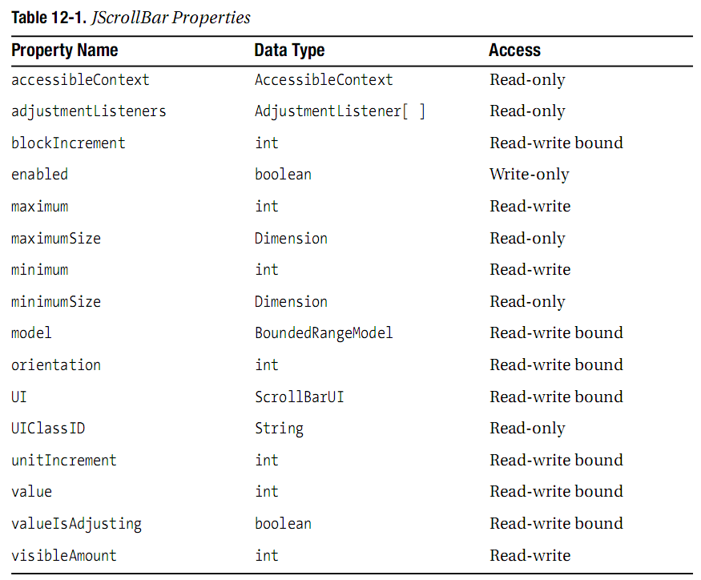
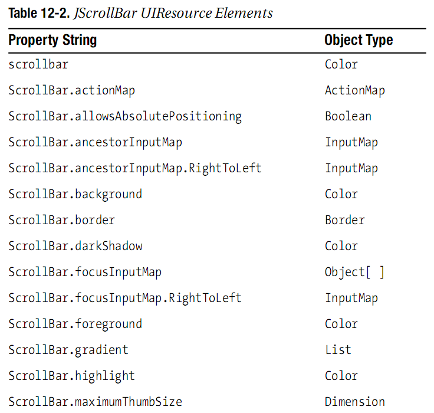

Bounded Range Components
========================

在前面的章节中，我们了解了当在屏幕没有足够的空间显示完整的组件时，JScrollPane如何提供了一个可滚动的区域。Swing同时提供了其他的一些支持某种滚动类型或是边界范围值显示的组件。这些可用的组件有JScrollBar，JSlider，JProgressBar，以及更为有限角度的JTextField。这些组件共享BoundedRangeModel作为他们的数据模型。Swing类所提供的这种数据模型的默认实现是DefaultBoundedRangeModel类。

在本章中，我们将会了解这些Swing组件的类似与不同之处。我们的讨论由共享的数据模型BoundedRangeModel开始。

BoundedRangeModel接口
---------------------

BondedRangeModel接口是本章中描述的组件所共享的MVC数据模型。这个接口包含了描述范围值minimum,
maximum, value, extent所必须的四个交互关联的属性。

minimum与maximum属性定义了模型值的范围。value属性定义了我们所认为的模型的当前设置，而value属性的最大值并不一定是模型的maximum属性值。相反，value属性可以使用的最大设置是小于extent属性的maximum属性。为了有助于我们理解这些属性，图12-1显示了这些设置与JScollBar的关系。extent属性的其他目的依赖于作为模型视图的属性。


四个属性的设置必须满足下列关系：

minimum &lt;= value &lt;= value+extent &lt;= maximum

当一个设置发生变化时，也许就会触发其他设置的变化，以满足上面的大小关系。例如，将minimum修改为当前value加上extent与maximum之间的一个设置会使得减少extent并且增加value来保持上面的大小关系。另外，原始属性的变化会导致修改为一个新设置而不是所请求的设置。例如，尝试将value设置为小于minimum或是maximum会将value设置为最接近范围极限的值。

BoundedRangeModel接口的定义如下：

``` java
public interface BoundedRangeModel { 
  // Properties
  public int  getExtent();
  public void setExtent(int newValue);
  public int  getMaximum();
  public void setMaximum(int newValue);
  public int  getMinimum();
  public void setMinimum(int newValue);
  public int  getValue();
  public void setValue(int newValue);
  public boolean getValueIsAdjusting();
  public void    setValueIsAdjusting(boolean newValue);
  // Listeners
  public void addChangeListener(ChangeListener listener);
  public void removeChangeListener(ChangeListener listener);
  // Other Methods
  public void setRangeProperties(int value, int extent, int minimum,
    int maximum, boolean adjusting);
}
```

尽管模型可用的不同属性设置是JavaBean属性，当属性设置发生变化时，接口使用Swing的ChangeListener方法而不是java.beans.PropertyChangeListener。

当用户正在执行一系列的模型快速变化时，也许是在屏幕上拖动滑块所造成的，模型的valueIsAdjusing属性就派上用场了。对于某些只对何时设置模型的最终值感兴趣的人，在getValueIsAdjusting()返回false之前监听器会忽略所有的改变。

DefaultBoundedRangeModel类
--------------------------

实际实现BoundedRangeModel接口的Swing类是DefaultBoundedRangeModel。这个类会小心处理为了保证不同属性值的相应顺序所必需的调整。他同时管理ChangeListener列表在模型发生变化时通知监听器。

DefaultBoundedRangeModel有两个构造函数：

``` java
public DefaultBoundedRangeModel()
public DefaultBoundedRangeModel(int value, int extent, int minimum, int maximum)
```

无参数版本会将模型的minimum,
value与extent属性设置为0。余下的maximum属性设置为100。

第二个构造函数版本需要四个整形参数，显式设置四个属性。对于这两个构造函数，valuesAdjusting属性的初始值均为false，因为模型值在初始值之外并没有发生变化。

注意，除非我们在多个组件之间共享模型，通常并没有必要创建BoundedRangeMode。如果我们要在多个组件之间共享模型，我们可以创建第一个组件，然后获取其BoundedRangeModel模型进行共享。

类似于通常的管理其监听器列表的所有类，我们可以向DefaultBoundedRangeModel查询赋给他的监听器。这里我们可以使用getListeners(ChangeListener.class)方法获取模型的ChangeListener列表。这会返回一个EventListener对象数组。

JScrollBar类
------------

最简单的边界范围组件是JScrollBar。JScrollBar组件用在我们在第11章所描述的JScrollPane容器中来控制滚动区域。我们也可以将这个组件用在我们自己的容器中，尽管由于JScrollPane的灵活性，通常并不必需这样做。然而关于JScrollBar我们需要记住的一点就是JScrollPane并用于值，而是用于屏幕的滚动区域。对于值，我们要使用在下节将要讨论的JSlider组件。

注意，JScrollPane中的JScrollBar实际是上是JScrollBar的一个特殊子类，他能够正确处理实现了Scrollable接口的可滚动组件。尽管我们可以修改JScrollPane的滚动条，但是通常并不需要这样做，而且所需要工作比我们认为要多得多。

如图12-2所示，水平的JScrollBar由几部分组成。由中间开始向前，我们可以看到滚动条的滑块。滑块的宽度是BoundedRangeModel的extent属性。滚动条的当前值是滑块的左边。滑块的左边与右边是块翻页区域。点击滑块的左边并减少滚动条的值，而点击右边会增加滚动条的值。滑块增加或减少的数量值是滚动条的blockIncrement属性。


在滚动条的左边与右边是箭头按钮。当点击左箭头时，滚动条会减少一个单元。滚动条的unitIncrement属性指定了这个单元。通常情况，这个值为1，尽管并不是必须这样。在左箭头的右边是滚动条的最小值与模型。除了用左箭头减少值以外，点击右箭头会使得滚动条增加一个单元。右箭头的左边是滚动条的最大范围。最大值实际上略远于左边，这里略远的距离是由模型的extent属性来指定的。当滑块紧邻右箭头时，这会将滚动条的滚动动条值放在滑块的左边，对于所有其他的位置也是如此。

垂直JScrollBar是由与水平JScrollBar相同的部分组成的，最小值与减少部分位顶部，而且值是由滚动条滑块的上边决定的。最小值与增加部分位于底部。

正如前面所提到的，JScrollBar模型是BoundedRangeModel。用户界面的委托是ScrollBarUI。

现在我们已经了解了JSrollBar的不同部分，现在我们来了解一下如何使用。

### 创建JScrollBar组件

JScrollBar有三个构造函数：

``` java
public JScrollBar()
JScrollBar aJScrollBar = new JScrollBar();
public JScrollBar(int orientation)
// Vertical
JScrollBar aJScrollBar = new JScrollBar(JScrollBar.VERTICAL);
// Horizontal
JScrollBar bJScrollBar = new JScrollBar(JScrollBar.HORIZONTAL);
public JScrollBar(int orientation, int value, int extent, int minimum, int maximum)
// Horizontal, initial value 500, range 0-1000, and extent of 25
JScrollBar aJScrollBar = new JScrollBar(JScrollBar.HORIZONTAL, 500, 25, 0, 1025);
```

使用无参数的构造函数会使用默认的数据模型创建一个垂直滚动条。模型的初始值为0，最小值为0，最大值为100，而扩展值为10。这个默认模型只提供了0到90的范围。我们可以显示的将方向设置为JScrollBar.HORIZONTAL或是JScrollBar.VERTICAL。如果我们不喜欢其他两个构造函数所提供的初始模型设置，我们需要自己进行显示的设置。如果数据元素没有正确的进行约束，正如前面关于BoundedRangeModel所描述的，则会抛出一个IllegalArgumentException，使得JScrollBar构造中断。

很奇怪没有出现在构造函数列表中的接受BoundedRangeModel参数的构造函数。如果我们有一个模型实例，我们可以在创建了滚动条之后调用setModel(BoundedRangeModel
newModel)方法或是在创建构造函数时由模型获取单个属性，如下所示：

``` java
JScrollBar aJScrollBar =
  new JScrollBar (JScrollBar.HORIZONTAL, aModel.getValue(), aModel.getExtent(),
    aModel.getMinimum(), aModel.getMaximum())
```

由J2SE平台的1.3版本开始，滚动条不再参与焦点遍历。

### 处理滚动事件

一旦我们创建了JScrollBar，如果我们对滚动条的值何时发生变化感兴趣，则我们需要监听这些变化。有两种监听的方法：AWT
1.1事件模型方法以及Swing
MVC方法。AWT方法涉及到将AdjustmentListener关联到JScrollBar。MVC方法涉及到将ChangeListener关联到数据模型。每一种方法都可以工作得很好，如果模型通过编程变化或是用户拖动滚动条滑块，两种方法都会得到通知。后一种方法提供了更多的灵活性，因而是一个不错的选择，除非我们是在多个组件之间共享数据模型并且需要知道哪一个组件修改了模型。

**使用AdjustmentListsener监听滚动事件**

将AdjustmentListener关联到JScrollBar使得我们可以监听用户修改滚动条设置。下面的代码片段，将会用在稍后的列表12-3中，显示了为了监听用户修改JScrollBar的值，我们如何将AdjustmentListsener关联到JScrollBar。

首先，定义简单输出滚动条当前值的AdjustmentListsener：

``` java
AdjustmentListener adjustmentListener = new AdjustmentListener() { 
  public void adjustmentValueChanged (AdjustmentEvent adjustmentEvent) { 
    System.out.println ("Adjusted: " + adjustmentEvent.getValue());
  }
};
```

在我们创建了监听器之后，我们可以创建组件并且关联监听器：

``` java
JScrollBar oneJScrollBar = new JScrollBar (JScrollBar.HORIZONTAL);
oneJScrollBar.addAdjustmentListener(adjustmentListener);
```

这种监听修改事件的方法可以工作得很完美。然而，我们也许会更喜欢将ChangeListener关联到数据模型。

**使用ChangeListener监听滚动事件**

将ChangeListener关联到JScrollBar数据模型会在我们的程序设计中提供更多的灵活性。使用AWT
AdjustmentListener，只有滚动条的值发生变化时监听器才会得到通知。另一方面，当最小值，最大值，当前值，以及扩展值发生变化时，所关联的ChangeListener会得到通知。另外，由于模型有一个valueIsAdjusting属性，我们可以选择忽略即时变化事件－一些我们可以使用AdjustmentListener，通过Adjustment中相同名的属性处理的事件。

为了进行演示，定义了一个当模型完成调整时输出滚动条当前值的ChangeListener，如列表12-1所示。我们可以通过本章来加强BoundedChangeListener类。

``` java
package swingstudy.ch11;

import javax.swing.BoundedRangeModel;
import javax.swing.event.ChangeEvent;
import javax.swing.event.ChangeListener;

public class BoundedChangeListener implements ChangeListener {

    @Override
    public void stateChanged(ChangeEvent event) {
        // TODO Auto-generated method stub

        Object source = event.getSource();
        if(source instanceof BoundedRangeModel) {
            BoundedRangeModel aModel = (BoundedRangeModel)source;
            if(!aModel.getValueIsAdjusting()) {
                System.out.println("Changed: "+aModel.getValue());
            }
        }
        else {
            System.out.println("Something changed: "+source);
        }
    }

}
```

一旦我们创建了监听器，我们也可以创建组件并且关联监听器。在这个特定的例子中，我们需要将监听器关联到组件的数据模型，而不是直接关联到组件。

``` java
ChangeListener changeListener = new BoundedChangeListener();
JScrollBar anotherJScrollBar = new JScrollBar (JScrollBar.HORIZONTAL);
BoundedRangeModel model = anotherJScrollBar.getModel();
model.addChangeListener(changeListener);
```

列表12-2显示了测试程序的源码。

``` java
package swingstudy.ch11;

import java.awt.BorderLayout;
import java.awt.EventQueue;
import java.awt.event.AdjustmentEvent;
import java.awt.event.AdjustmentListener;

import javax.swing.BoundedRangeModel;
import javax.swing.JFrame;
import javax.swing.JScrollBar;
import javax.swing.event.ChangeListener;

public class ScrollBarSample {

    /**
     * @param args
     */
    public static void main(String[] args) {
        // TODO Auto-generated method stub

        Runnable runner = new Runnable() {
            public void run() {
                AdjustmentListener adjustmentListener = new AdjustmentListener() {
                    public void adjustmentValueChanged(AdjustmentEvent event) {
                        System.out.println("Adjusted: "+event.getValue());
                    }
                };

                JScrollBar oneJScrollBar = new JScrollBar(JScrollBar.HORIZONTAL);
                oneJScrollBar.addAdjustmentListener(adjustmentListener);

                ChangeListener changeListener = new BoundedChangeListener();
                JScrollBar anotherJScrollBar = new JScrollBar(JScrollBar.HORIZONTAL);
                BoundedRangeModel model = anotherJScrollBar.getModel();
                model.addChangeListener(changeListener);

                JFrame frame = new JFrame("ScrollBars R US");
                frame.setDefaultCloseOperation(JFrame.EXIT_ON_CLOSE);
                frame.add(oneJScrollBar, BorderLayout.NORTH);
                frame.add(anotherJScrollBar, BorderLayout.SOUTH);
                frame.setSize(300, 200);
                frame.setVisible(true);
            }
        };
        EventQueue.invokeLater(runner);
    }

}
```

当运行这个程序时，他会显示两个水平滚动条，如图12-3所示。移动滚动条的输出发送到终端容器。


### JScrollBar属性

在我们创建了JScrollBar之后，修改其底层数据模型就变得必要了。我们可以使用public
BoundedRangeModel
getModel()方法获得模型，然后直接修改模型。更可能的，我们仅需要调用组件的相应方法：

``` java
• setValue(int newValue), setExtent(int newValue), setMinimum(int newValue)
• setMaximum(int newValue)
```

注意，尽管支持，但是并不推荐在显示组件之后修改JScrollBar方向。这会极大的影响用户的满意度并且使得用户去寻找其他的解决方案。

除了数据模型属性，表12-1显示了JScrollBar的16个属性。



### 自定义JScrollBar观感

每一个可安装的Swing观感都提供了不同的JScrollBar外观以及默认的UIResource值集合。图12-4显示了预安装的观感类型Motif，Windows，以及Ocean的JScrollBar组件的外观。


表12-2显示了JScrollBar的UIResource相关属性集合。有28个不同的属性。




JSlider类
---------

尽管JScrollBar对于屏幕滚动区域十分有用，但是他并不适用于使得用户在一个范围内进行输入。对于这个目的，Swing提供了JSlider组件。除了提供了类似JScrollBar组件所提供的可拖动滑块以外，JSlider同时提供了可视化的标记以及标签来辅助显示当前的设置并且选择新的设置。图12-5显示了几个JSlider组件的示例。


JSlider是由几部分组成的。我们所熟悉的BoundedRangeModel存储组件的数据模型，而Dictionary存储用于标记的标签。用户界面委托是SliderUI。

现在我们已经了解了JSlider组件的不同部分，下面我们来探讨如何使用JSlider。

### 创建JSlider组件

JSlider有六个构造函数：

``` java
public JSlider()
JSlider aJSlider = new JSlider();
public JSlider(int orientation) 
// Vertical
JSlider aJSlider = new JSlider(JSlider.VERTICAL);
// Horizontal
JSlider bJSlider = new JSlider(JSlider.HORIZONTAL);
public JSlider(int minimum, int maximum)
// Initial value midpoint / 0
JSlider aJSlider = new JSlider(-100, 100);
public JSlider(int minimum, int maximum, int value)
JSlider aJSlider = new JSlider(-100, 100, 0);
public JSlider(int orientation, int minimum, int maximum, int value)
// Vertical, initial value 6, range 1-12 (months of year)
JSlider aJSlider = new JSlider(JSlider.VERTICAL, 6, 1, 12);
public JSlider(BoundedRangeModel model)
// Data model, initial value 3, range 1-31, and extent of 0
// JSlider direction changed to vertical prior to display on screen
DefaultBoundedRangeModel model = new DefaultBoundedRangeModel(3, 0, 1, 31);
JSlider aJSlider = new JSlider(model);
aJSlider.setOrientation(JSlider.VERTICAL);
```

使用无参数的构造函数会使用默认的数据模型创建一个水平滑动器。模型的初始值为50，最小值为0，最大值为100，而扩展值为0。我们也可以使用JSlider.HORIZONTAL或是JSlider.VERTICAL显示设置方向，使用各种构造函数设置特定的模型属性。另外，我们也可以显式设置组件的数据模型。

如果我们使用一个预配置的BoundedRangeModel，记住当创建模型时要将扩展值设置为0。如果extent属性大于0，value属性的最大设置就会减少相应的值，而且value设置绝不会达到maximum属性设置。

注意，将方向初始化为VERTICAL与HORIZONTAL以外的值会抛出IllegalArgumentException。如果范围与初始值不遵循BoundedRangeModel的规则，则实始化数据模型的所有构造函数会抛出IllegalArgumentException。

### 处理JSlider事件

我们可以使用ChangeListener监听JSlider的变化。与JScrollBar不同，JSlider并没有AdjustmentListener。可以将前面JScrollBar示例中的BoundedChangeListener添加到JSlider的数据模型，然后当模型发生变化时我们就可以得到通知。

``` java
ChangeListener aChangeListener = new BoundedChangeListener();
JSlider aJSlider = new JSlider ();
BoundedRangeModel model = aJSlider.getModel();
model.addChangeListener(changeListener);
```

除了将ChangeListener关联到模型，我们还可以将ChangeListener直接关联到JSlider本身。这可以使得我们在视图与独立监听变化之间共享数据模型。这需要我们略微修改前面的监听器，因为现在变化的事件源是JSlider，而不是BoundedRangeModel。更新的BoundedChangeListener显示在列表12-3中，可以适用于两种情况下的关联。在下面的列表中变化的部分以粗体标出。

``` java
package swingstudy.ch11;

import javax.swing.BoundedRangeModel;
import javax.swing.JSlider;
import javax.swing.event.ChangeEvent;
import javax.swing.event.ChangeListener;

public class BoundedChangeListener implements ChangeListener {

    @Override
    public void stateChanged(ChangeEvent event) {
        // TODO Auto-generated method stub

        Object source = event.getSource();
        if(source instanceof BoundedRangeModel) {
            BoundedRangeModel aModel = (BoundedRangeModel)source;
            if(!aModel.getValueIsAdjusting()) {
                System.out.println("Changed: "+aModel.getValue());
            }
        }
        else if(source instanceof JSlider) {
            JSlider theJSlider = (JSlider)source;
            if(!theJSlider.getValueIsAdjusting()) {
                System.out.println("Slider changed: "+theJSlider.getValue());
            }
        }
        else {
            System.out.println("Something changed: "+source);
        }
    }

}
```

与滑动器的关联可以直接进行，而无需通过模型间接进行。

aJSlider.addChangeListener(changeListener);

### JSlider属性

在我们创建了JSlider之后，我们也许希望修改其底层数据模型。类似于JScrollBar，我们可以使用public
BoundedRangeModel
getModel()方法获取模型，然后直接修改模型。我们也可以直接调用组件的方法：

``` java
• setValue(int newValue), setExtent(int newValue), setMinimum(int newValue)
• setMaximum(int newValue)
```

类似于JScrollBar，这些方法只是作为代理，并且将方法调用重定向到对应的模型方法。

表12-3显示了JSlider的19个属性。


**在JSlider中显示刻度标记**

JSlider组件允许我们可以在水平滑动器的下边或是垂直滑动器的右边添加刻度标记。这些标记可以使得用户大致估计滑动器的值与尺度。可以具有主标记与次标记；主标记的绘制要略微长些。可以显示一个或是两个同时显示，也可以都不显示，而这则是默认设置。

注意，由技术上来说，自定义的观感可以将标记放置在任何地方。然而，系统提供的观感类型将标记放置在下边或是右边。

要显示刻度标记，我们需要使用public void setPaintTicks(boolean
newValue)方法允许刻度绘制。当使用true设置来调用时，该方法会以允许次标记与主标记的绘制。默认情况下，两种刻度标记类型的刻度空间被设置为0。当有一个设置为0时，则该刻度类型不会显示。因为两个都初始为0，我们必须修改一个刻度空间的值来查看刻度。public
void setMajorTickSpacing(int newValue)与public void
setMinorTickSpacing(int newValue)方法都支持这种修改。

为了进行演示，图12-6显示了四个滑动器。这有利于主刻度空间是次刻度空间整数倍的情况。另外，刻度空间不应太窄，因而使得刻度看起来像是一个块。


图12-6中的示例源码显示在列表12-4中。顶部的滑动器没有刻度。底部的滑动器具有主刻度空间与次刻度空间，次刻度为5个单位，而主刻度为25个单位。左边的滑动器显示了一个糟糕的刻度空间，次刻度为6个单位，而主刻度为25个单位。右边的滑动器次刻度为单个单元，结果导致空间过于紧凑。

``` java
package swingstudy.ch11;

import java.awt.BorderLayout;
import java.awt.EventQueue;

import javax.swing.JFrame;
import javax.swing.JSlider;

public class TickSliders {

    /**
     * @param args
     */
    public static void main(String[] args) {
        // TODO Auto-generated method stub

        Runnable runner = new Runnable() {
            public void run() {
                JFrame frame = new JFrame("Tick Slider");
                frame.setDefaultCloseOperation(JFrame.EXIT_ON_CLOSE);

                // No Ticks
                JSlider jSliderOne = new JSlider();
                // Major tick 25 - Minor 5
                JSlider jSliderTwo =  new JSlider();
                jSliderTwo.setMinorTickSpacing(5);
                jSliderTwo.setMajorTickSpacing(25);
                jSliderTwo.setPaintTicks(true);
                jSliderTwo.setSnapToTicks(true);
                // Major Tick 25 - Minor6
                JSlider jSliderThree = new JSlider(JSlider.VERTICAL);
                jSliderThree.setMinorTickSpacing(6);
                jSliderThree.setMajorTickSpacing(25);
                jSliderThree.setPaintTicks(true);
                // Major Tick 25 - Minor 1
                JSlider jSliderFour = new JSlider(JSlider.VERTICAL);
                jSliderFour.setMinorTickSpacing(1);
                jSliderFour.setMajorTickSpacing(25);
                jSliderFour.setPaintTicks(true);

                frame.add(jSliderOne, BorderLayout.NORTH);
                frame.add(jSliderTwo, BorderLayout.SOUTH);
                frame.add(jSliderThree, BorderLayout.WEST);
                frame.add(jSliderFour, BorderLayout.EAST);
                frame.setSize(300, 200);
                frame.setVisible(true);
            }
        };
        EventQueue.invokeLater(runner);
    }

}
```

**停靠JSlider滑块位置**

另一个与刻度标记相关的JSlider属性是通过public void
setSnapToTicks(boolean
newValue)方法设置的snapToTicks属性。当这个属性为true且显示在刻度标记时，在我们移动了滑块之后，滑块只停留在刻度处。例如，滑动器的滑块范围为0到100，并且每一个刻度为10个单位，如果我们将滑块拖动到33刻度处，滑块就会停靠30刻度处。如果刻度标记没有显示，属性设置没有影响，包括没有刻度标记显示标签时。

**标记JSlider位置**

如图12-5所示，我们可以使用Component标记JSlider中的位置。当一个位置被标记，组件会相邻显示。标记存储在一个派生自Dictionary类的查询表中，其中键值是Integer位置，而值则是Component。任何的AWT
Component都可以是标签；然而，JLabel最合适这一角色。图12-7显示了图12-5中右边滑动器的词典的样子。


通常，Dictionary将标签存储在一个Hashtable中。然而，扩展自Dictionary类并且使用Integer键值的类也可以。在我们创建了我们的标签词典以后，我们可以使用public
void setLabelTable(Dictionary
newValue)方法将词典与滑动器相关联。下面的代码创建与一个与图12-7相关联的标签查询表。

``` java
Hashtable<Integer, JLabel> table = new Hashtable<Integer, JLabel>();
table.put (0, new JLabel(new DiamondIcon(Color.RED)));
table.put (10, new JLabel("Ten"));
table.put (25, new JLabel("Twenty-Five"));
table.put (34, new JLabel("Thirty-Four"));
table.put (52, new JLabel("Fifty-Two"));
table.put (70, new JLabel("Seventy"));
table.put (82, new JLabel("Eighty-Two"));
table.put (100, new JLabel(new DiamondIcon(Color.BLACK)));
aJSlider.setLabelTable (table);
```

注意，请记住在J2SE 5.0中，编译器会自动将一个int参数装箱为一个Integer。

简单的标签表与滑动器相关联并不会显示标签。为了能够绘制标签，我们必须使用参数true来调用public
void setPaintLabels(boolean
newValue)方法。如果我们没有手动创建标签表，系统会使用反映主标记空间的内部值来为我们创建一个。例如，图12-5中左边的滑动器的范围为0到100，而主标记空间为10。当在这个滑动器上调用stPaintLabels(true)方法，标签创建在0，10，20等处，直到100。次标记空间与标签的自动生成无关。而且为了标签显示标记并不需要绘制；getPaintTicks()方法可以返回false。

标签的自动创建是通过public Hashtable createStandardLabels(int
increment)方法实现的，其中increment是主标记空间。我们并不需要直接调用这个方法。如果我们希望并不由最小值创建标签，我们可以调用重载的public
Hashtable createStandardLabels(int increment, int start)方法
，并且将哈希表关联到滑动器。

### 自定义JSlider观感

每一个可安装的Swing观感都提供了不同的JSlider外观以及默认的UIResource值集合。图12-8显示了预安装的观感类型集合下的JSlider组件的外观。


两个观感类型相关的属性是JSlider类定义的一部分。默认情况下，水平滑动器的最小滑块值位于左边；对于垂直滑动器，则是在下边。要修改滑动器的方向，使用参数true调用public
void setInverted(boolean
newValue)方法。另外，滑块沿着移动的轨道默认显示。我们可以通过public void
setPaintTrack(boolean
newValue)方法来关闭显示。false值会关闭轨道显示。图12-9显示了JSlider轨道的样子并且标出了常规与相反滑动器的最小值与最大值位置。


表12－4显示了JSlider的30个UIResource相关的属性。


JSlider资源允许我们自定义通过JSlider或是SliderUI方法不能访问的元素。例如，要自定义我们程序的的JSlider外观，我们也许希望修改可拖动的滑块的图标。通过很少的几行代码，我们可以使用任意的图标作为我们程序中滑动器的滑动图标。

``` java
Icon icon = new ImageIcon("logo.jpg");
UIDefaults defaults = UIManager.getDefaults();
defaults.put("Slider.horizontalThumbIcon", icon);
```

图12-10显示了结果。类似于所有的UIResource属性，这种修改将会影响在设置属性之后所创建的所用的JSlider组件。


注意，图标的高度与宽度受限于滑动器的维度。修改icon属性并不会影响滑动器尺寸。

### JSlider客户属性

默认情况下，对于Metal观感，当轨道可见时，当滑块在其上移动时轨道并不会变化。而且，我们可以允许将会通知滑块填充滑块所移动过的直到当前的值的轨道部分的客户属性。这个属性名为JSlider.isFilled，而Boolean对象表示当前的设置。默认情况下，这个设置为Boolean.FALSE。图12-11演示了Boolean.TRUE与Boolean.FALSE设置；代码片段如下：

``` java
JSlider oneJSlider = new JSlider();
oneJSlider.putClientProperty("JSlider.isFilled", Boolean.TRUE);
JSlider anotherJSlider = new JSlider();
// Set to default setting
anotherJSlider.putClientProperty("JSlider.isFilled", Boolean.FALSE);
```


这个设置只在Metal观感下起作用。Metal观感的Ocean主题会忽略这一设置，总是绘制填充的轨道。要获得这一行为，我们需要将系统属性swign.metalTheme设置为steel，例如java
-Dswing.metalTheme=steel ClassName。

JProgressBar类
--------------

Swing的JProgressBar不同于其他的BoundedRangeModel组件。其主要目的并不是由用户获取输入，而是展示输出。输出以过程完成百分比的方式进行显示。当百分比增加时，在组件上会显示一个过程栏，直接工作完成并且过程栏被填满。过程栏的运动通常是某些多线程任务的一部分，从而避免影响程序的其他部分。

图12-12显示了一些示例JProgressBar组件。顶部的过程栏使用所有的显示特性。底部的过程栏在组件的周围添加了一个边框，并且显示完成百分比。右边的过程栏移除了边框，而左边的过程栏具有一个固定的字符串表示来替换完成百分比。


由面向对象的角度来看，JProgressBar有两个主要部分：我们所熟悉的BoundedRangeModel存储组件的数据模型，而ProgressUI是用户界面委托。

注意，在对话框中显示一个过程栏，使用在第9章所讨论的ProgressMonitor类。

### 创建JProgressBar组件

JProgressBar有五个不同的构造函数：

``` java
public JProgressBar()
JProgressBar aJProgressBar = new JProgressBar();
public JProgressBar(int orientation)
// Vertical
JProgressBar aJProgressBar = new JProgressBar(JProgressBar.VERTICAL);
// Horizontal
JProgressBar bJProgressBar = new JProgressBar(JProgressBar.HORIZONTAL);
public JProgressBar(int minimum, int maximum)
JProgressBar aJProgressBar = new JProgressBar(0, 500);
public JProgressBar(int orientation, int minimum, int maximum)
JProgressBar aJProgressBar = new JProgressBar(JProgressBar.VERTICAL, 0, 1000);
public JProgressBar(BoundedRangeModel model)
// Data model, initial value 0, range 0-250, and extent of 0
DefaultBoundedRangeModel model = new DefaultBoundedRangeModel(0, 0, 0, 250);
JProgressBar aJProgressBar = new JProgressBar(model);
```

使用无参数的构造函数创建JProgressBar时会使用默认的数据模型创建一个水平的过程栏。模型的初始值为0，最小值为0，而最大值为100，扩展值为0。过程栏有一个扩展，但是不使用，尽管他是数据模型的一部分。

我们可以使用JProgressBar.HORIZONTAL或是JProgressBar.VERTICAL显示设置方向，同时可以使用不同的构造函数设置任意的特定模型属性。另外，我们可以为组件显示设置数据模型。

注意，将方向设置为VERTICAL或HORIZONTAL以外的值会抛出IllegalArgumentException。

由BoundedRangeModel创建JProgressBar有一些笨拙，因为过程栏会忽略一个设置并且初始值被初始化为最小值。假定我们希望JProgressBar向用户所期望的样子启动，我们需要记住当创建模型时要将扩展设置为0，并且将值设置最小值。如果我们增加extent属性，value属性的最大设置就会减少相应的量，从而value设置不会达到maximum属性的设置。

### JProgressBar属性

在我们创建了JProgressBar之后，我们需要对其进行修改。表12-5显示了JProgressBar的14个属性。


**绘制JProgressBar边框**

所有的JComponent子类默认都有一个border属性，而JProgressBar有一个特殊的borderPainted属性可以很容易的允许或是禁止边框的绘制。使用参数false调用public
void setBorderPainted(boolean
newValue)方法可以关闭过程栏边框的绘制。图12-12右侧的过程栏就关闭了其边框。其初始化代码如下：

``` java
JProgressBar cJProgressBar = new JProgressBar(JProgressBar.VERTICAL);
cJProgressBar.setBorderPainted(false);
```

**标识JProgressBar**
JProgressBar支持在组件中间显示文本。这种标签有三种形式：

-   默认情况下不存在标签。
-   要显示完成的百分比\[100x(value-minimum)/(maximum-minimum)\]，使用参数true调用public
    void setStringPainted(boolean
    newValue)。这会显示0%到100%范围内的值。
-   要将标签修改为固定的字符串，调用public void setString(String
    newValue)方法与setStringPainted(true)。在垂直过程栏上，字符串被反转绘制，所以较长的字符串会更适合。

图12-12的左边与底部过程栏分别显示了固定标签与百分比标签。创建这两个过程栏的代码如下：

``` java
JProgressBar bJProgressBar = new JProgressBar();
bJProgressBar.setStringPainted(true);
Border border = BorderFactory.createTitledBorder("Reading File");
bJProgressBar.setBorder(border);
JProgressBar dJProgressBar = new JProgressBar(JProgressBar.VERTICAL);
dJProgressBar.setString("Ack");
dJProgressBar.setStringPainted(true);
```

**使用不确定的JProgressBar**

某些过程并没有固定的步骤数目，或者是他们具有固定的步骤数目，但是我们并不知道在所有的步骤完成之间的数目。对于这种操作类型，JProgressBar提供了一种不确定模式，在这种模式中依据过程栏的方向，JProgressBar中的过程栏会由一边到另一边不断运行，或是由上到下不断运动。要允许这种模式，只需要使用true值为调用public
void setIndeterminate(boolean
newValue)方法。图12-13显示了不确定过程栏在不同时刻的样子。滑动块的长度是可用空间的六分之一，并且是不可设置的。


**沿着JProgressBar步进**

JProgressBar的主要用法显示我们在一系列操作中前进的过程。通常情况下，我们将过程栏最小值设置为0，而最大值设置为要执行的步骤数目。由value属性值0开始，当我们执行每一个步骤时向增加值向最大值靠近。所有这些操作意味着多线程，事实上，这是绝对必需的。另外，当更新过程栏的值时，我们需要记住只能在事件分发线程中更新（借助于EventQueue.invokeAndWait()方法）。

过程栏在一个范围内前进的过程如下：

1、初始化。这是使用所需要的方向与范围创建JProgressBar的基本过程。另外，在这个过程中执行边框与标签操作。

``` java
JProgressBar aJProgressBar = new JProgressBar(0, 50);
aJProgressBar.setStringPainted(true);
```

2、启动线程执行所需要的步骤。也许是作为在屏幕上执行动作的结果，我们需要启动线程来完成过程栏的工作。我们需要启动一个新线程，从而用户界面可以保持响应。

``` java
Thread stepper = new BarThread (aJProgressBar);
stepper.start();
```

3、执行步骤。忽略更新过程栏，而是编写相应的代码来执行每一个步骤。

``` java
static class BarThread extends Thread {
  private static int DELAY = 500;
  JProgressBar progressBar;
  public BarThread (JProgressBar bar) {
    progressBar = bar;
  } 
  public void run() {
    int minimum = progressBar.getMinimum();
    int maximum = progressBar.getMaximum();
    for (int i=minimum; i<maximum; i++) {
      try {
        // Our job for each step is to just sleep
        Thread.sleep(DELAY);
      }  catch (InterruptedException ignoredException) {
      }  catch (InvocationTargetException ignoredException) {
        // The EventQueue.invokeAndWait() call
        // we'll add will throw this
      }
    }
  }
} 
```

4、对于每一个步骤，使得线程在事件线程内更新过程栏。在for循环之外只创建一次Runnable类。没有必要为每一个步骤创建一个。

``` java
Runnable runner = new Runnable() { 
  public void run() { 
    int value = progressBar.getValue();
    progressBar.setValue(value+1);
  } 
};
```

在循环之内，通知runner更新过程栏。这个更新必须使用特殊的EventQueue方法invokeLater()或是invokeAndWait()在事件线程内完成，因为我们正在更新JProgressBar的属性。

``` java
EventQueue.invokeAndWait (runner);
```

完整的运行示例显示在列表12-5中。

``` java
package swingstudy.ch12;

import java.awt.BorderLayout;
import java.awt.EventQueue;
import java.awt.event.ActionEvent;
import java.awt.event.ActionListener;
import java.lang.reflect.InvocationTargetException;

import javax.swing.JButton;
import javax.swing.JFrame;
import javax.swing.JProgressBar;

public class ProgressBarStep {

    static class BarThread extends Thread {
        private static int DELAY = 500;
        JProgressBar progressBar;

        public BarThread(JProgressBar bar) {
            progressBar = bar;
        }

        public void run() {
            int minimum = progressBar.getMinimum();
            int maximum = progressBar.getMaximum();
            Runnable runner = new Runnable() {
                public void run() {
                    int value = progressBar.getValue();
                    progressBar.setValue(value+1);
                }
            };
            for(int i=minimum; i<maximum; i++) {
                try {
                    EventQueue.invokeAndWait(runner);
                    // Our job for each step is to just sleep
                    Thread.sleep(DELAY);
                }
                catch(InterruptedException ignoredException) {

                }
                catch(InvocationTargetException ignoredException){

                }
            }
        }
    }
    /**
     * @param args
     */
    public static void main(String[] args) {
        // TODO Auto-generated method stub

        Runnable runner = new Runnable() {
            public void run() {
                JFrame frame = new JFrame("Stepping Progress");
                frame.setDefaultCloseOperation(JFrame.EXIT_ON_CLOSE);
                final JProgressBar aJProgressBar = new JProgressBar(0,50);
                aJProgressBar.setStringPainted(true);

                final JButton aJButton = new JButton("Start");

                ActionListener actionListener = new ActionListener() {
                    public void actionPerformed(ActionEvent event) {
                        aJButton.setEnabled(false);
                        Thread stepper = new BarThread(aJProgressBar);
                        stepper.start();
                    }
                };

                aJButton.addActionListener(actionListener);
                frame.add(aJProgressBar, BorderLayout.NORTH);
                frame.add(aJButton, BorderLayout.SOUTH);
                frame.setSize(300, 200);
                frame.setVisible(true);
            }
        };
        EventQueue.invokeLater(runner);
    }

}
```


通过简单的将列表12-5中的sleep动作修改为所需要的操作，这个示例提供了一个合适的重用框架。

注意，要使得过程栏填充相反的方向，使得值由最大值开始并且在每一个步骤减小。也许我们并不希望显示完成的百分比字符串，因为他将由100%开始减小到0%。

### 处理JProgressBar事件

由技术上来说，JProgressBar类通过ChangeListener支持数据模型变化的通知。另外，我们可以将ChangeListener关联到其数据模型。因为过程栏更多的意味着提供可视化的输出而不是获得输入，我们通常并会对其使用ChangeListener。然而，有时这却是适用的。要重用本章前面列表12-3中的BoundedRangeChangeListener，对其进行修改（列表12-6中以粗体显示），因为这些变化事件的源是JProgressBar。

``` java
package swingstudy.ch12;

import javax.swing.BoundedRangeModel;
import javax.swing.JProgressBar;
import javax.swing.JSlider;
import javax.swing.event.ChangeEvent;
import javax.swing.event.ChangeListener;

public class BoundedChangeListener implements ChangeListener {

    @Override
    public void stateChanged(ChangeEvent event) {
        // TODO Auto-generated method stub

        Object source = event.getSource();
        if(source instanceof BoundedRangeModel) {
            BoundedRangeModel aModel = (BoundedRangeModel)source;
            if(!aModel.getValueIsAdjusting()) {
                System.out.println("Changed: "+aModel.getValue());
            }
        }
        else if(source instanceof JSlider) {
            JSlider theJSlider = (JSlider)source;
            if(!theJSlider.getValueIsAdjusting()) {
                System.out.println("Slider changed: "+theJSlider.getValue());
            }
        }
        else if(source instanceof JProgressBar) {
            JProgressBar theJProgressBar = (JProgressBar)source;
            System.out.println("ProgressBar changed: "+theJProgressBar.getValue());
        }
        else {
            System.out.println("Something changed: "+source);
        }
    }

}
```

### 自定义JProgressBar观感

每一个可安装的Swing观感都提供了不同的JProgressBar外观以及默认的UIResource值集合。图12-5显示了JProgressBar组件在预安装的观感类型集合下的外观。

表12-6显示了JProgressBar可用的UIResource相关属性的集合。他具有15个不同的属性。


JTextField类与BoundedRangeModel接口
-----------------------------------

JTextField组件并不是一个技术上的bounded-range组件，但是，他却使用BoundedRangeModel。当组件内容的宽度超出其可见的水平空间时，内建在JTextField内部的是一个可滚动的区域。BoundedRangeModel控制这个滚动区域。我们将会在第15章更详细的探讨JTextField组件。在这里我们可以了解JSrollBar如何跟踪JTextFiled的滚动区域。图12-16显示了一个实际的例子，而列表12-7显示了源码。


``` java
package swingstudy.ch12;

import java.awt.BorderLayout;
import java.awt.EventQueue;
import java.awt.event.ActionEvent;
import java.awt.event.ActionListener;

import javax.swing.BoundedRangeModel;
import javax.swing.BoxLayout;
import javax.swing.JFrame;
import javax.swing.JPanel;
import javax.swing.JScrollBar;
import javax.swing.JTextField;

public class TextSlider extends JPanel {

    private JTextField textField;
    private JScrollBar scrollBar;

    public TextSlider() {
        setLayout(new BoxLayout(this, BoxLayout.Y_AXIS));
        textField =  new JTextField();
        scrollBar = new JScrollBar(JScrollBar.HORIZONTAL);
        BoundedRangeModel brm = textField.getHorizontalVisibility();
        scrollBar.setModel(brm);
        add(textField);
        add(scrollBar);
    }

    public JTextField getTextField() {
        return textField;
    }

    public String getText() {
        return textField.getText();
    }

    public void addActionListener(ActionListener l) {
        textField.addActionListener(l);
    }

    public void removeActionListener(ActionListener l) {
        textField.removeActionListener(l);
    }

    public JScrollBar getScrollBar() {
        return scrollBar;
    }

    /**
     * @param args
     */
    public static void main(String[] args) {
        // TODO Auto-generated method stub

        Runnable runner = new Runnable() {
            public void run() {
                JFrame frame = new JFrame("Text Slider");
                frame.setDefaultCloseOperation(JFrame.EXIT_ON_CLOSE);
                final TextSlider ts = new TextSlider();
                ts.addActionListener(new ActionListener() {
                    public void actionPerformed(ActionEvent e) {
                        System.out.println("Text: "+ts.getText());
                    }
                });
                frame.add(ts, BorderLayout.NORTH);
                frame.setSize(300, 100);
                frame.setVisible(true);
            }
        };

        EventQueue.invokeLater(runner);
    }

}
```

通常情况下，JTextField并没有相关联的滚动条。事实上，大多数的观感类型并不提供。然而，如果这个组件是我们希望进行交互的组件，我们可以在我们的程序中进行重用。大量的访问方法可以重用得很简单，而且我们可以避免直接访问内部成员的需要。

小结
----

在本章中，我们了解了如何使用Swing的JScrollBar，JSlider与JProgressBar组件。我们了解了每一个组件如何使用BoundedRangeModel接口来控制操作这些组件所必需的内部数据，以及DefaultBoundedRangeModel类如何为这个数据模型提供了一个默认实现。

现在我们知道了如何使用各种具有边界范围的组件，我们可以继续进入第13章，在那里我们将会了解提供数据选择的控件：JList与JComboBox。
